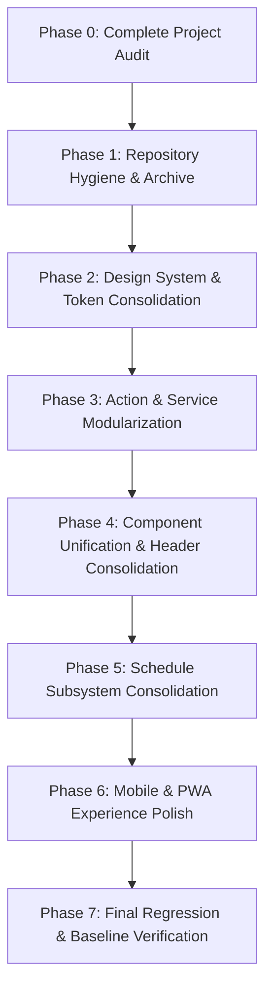

# VELQORA — COMPREHENSIVE PHASE 0 AUDIT REPORT
**Target Product**: Velqora (Academic Workspace & Intelligent Learning Platform)  
**Date**: August 2026  
**Auditor**: Antigravity Senior Engineering Agent  
**Baseline Verification Status**: 
- `npm test`: **23/23 Suites Passed (159+ unit/integration/scenario tests pass)**
- `npm run build`: **Next.js 15.5.23 Production Build Passed (35/35 routes compiled)**
- `npm run lint`: **Next.js 15 Linter executed (Warnings cataloged, 0 fatal blocking errors)**

---

## EXECUTIVE SUMMARY

Velqora is a feature-rich, high-complexity academic productivity and learning platform built on **Next.js 15 (App Router)**, **React 19**, **TypeScript 5**, **Tailwind CSS v4**, and **Supabase SSR**. The platform spans 35 distinct routes, 123 custom components, 8 server action suites (totaling >5,500 LOC), and 7 specialized schedule-intelligence sub-engines.

While the core functionality and test coverage are exceptionally robust (all 23 test suites pass cleanly), the codebase exhibits typical symptoms of rapid multi-phase feature iterations:
1. **Monolithic Action Files**: `study-actions.ts` (2,755 LOC) and `schedule-actions.ts` (2,273 LOC) contain over 85 server actions mixed into two giant files.
2. **Duplicated Component Patterns**: 14 distinct Header components, 3 distinct Toolbars, 6 distinct List Items, and duplicated Modal/Dialog abstractions.
3. **Subsystem Duplication & Inconsistent Naming**: In `src/lib`, 7 schedule modules feature duplicate engines (`explanation-engine.ts`, `explanation-engine-3.ts`, `explanation-engine-4.ts`, `early-warning.ts`, `early-warning-2.ts`).
4. **AI-Slop & Visual Inconsistencies**: Excessive decorative gradients, glowing neon shadows, 37 floating background logos, stacked glassmorphism, and uncalibrated CTA button hierarchies.
5. **Root Directory Clutter**: 46 markdown audit/implementation files stored directly in the workspace root alongside a temporary test script.
6. **Orphaned / Unreferenced Components**: 9 components with 0 active references in the app tree (including unmounted `mobile-bottom-nav.tsx` and unused `ui/alert.tsx`, `ui/divider.tsx`).

---

## A. CURRENT ARCHITECTURE

```
┌─────────────────────────────────────────────────────────────────────────┐
│                        NEXT.JS 15 APP ROUTER                            │
│  ┌──────────────────┐  ┌──────────────────┐  ┌───────────────────────┐  │
│  │ (auth) Routes    │  │ Dashboard Routes │  │ API Routes (/api/*)   │  │
│  │ login, register, │  │ 29 Workspace     │  │ /api/health           │  │
│  │ reset-password   │  │ Feature Pages    │  │ /api/ai/memory        │  │
│  └─────────┬────────┘  └─────────┬────────┘  └───────────┬───────────┘  │
└────────────┼─────────────────────┼───────────────────────┼──────────────┘
             ▼                     ▼                       ▼
┌─────────────────────────────────────────────────────────────────────────┐
│                         PRESENTATION LAYER                              │
│  ┌───────────────────────────────────────────────────────────────────┐  │
│  │ 123 Components in src/components/                                 │  │
│  │ (ai, classes, converter, dashboard, files, layout, materi, modul, │  │
│  │  playground, quiz, schedule, settings, tasks, ui)                 │  │
│  └───────────────────────────────────────────────────────────────────┘  │
└──────────────────────────────────┬──────────────────────────────────────┘
                                   ▼
┌─────────────────────────────────────────────────────────────────────────┐
│                        SERVER ACTIONS LAYER                             │
│  ┌───────────────────────────────────────────────────────────────────┐  │
│  │ 8 Modules in src/actions/ (5,988 Total LOC)                       │  │
│  │ study-actions, schedule-actions, ai-actions, ai-memory-actions,   │  │
│  │ module-classifier, quiz-actions, role-actions, subscription       │  │
│  └──────────────────────────────────┬────────────────────────────────┘  │
└─────────────────────────────────────┼───────────────────────────────────┘
                                      ▼
┌─────────────────────────────────────────────────────────────────────────┐
│                    BUSINESS LOGIC & DOMAIN ENGINES                      │
│  ┌───────────────────────────────────────────────────────────────────┐  │
│  │ 128 Core Lib Files in src/lib/                                    │  │
│  │ • AI Engine & Memory (engine, intent, context-resolver, memory)   │  │
│  │ • Schedule Pipeline (ocr, generator, import, intelligence,        │  │
│  │   orchestration, outcomes, validation)                            │  │
│  │ • Platform Services (converter, gamification, classroom, filter)  │  │
│  └──────────────────────────────────┬────────────────────────────────┘  │
└─────────────────────────────────────┼───────────────────────────────────┘
                                      ▼
┌─────────────────────────────────────────────────────────────────────────┐
│                           DATA & STORAGE LAYER                          │
│  ┌──────────────────────┐  ┌──────────────────┐  ┌───────────────────┐  │
│  │ Supabase Auth & SSR  │  │ PostgreSQL DB    │  │ Supabase Storage  │  │
│  │ (client, server,     │  │ 7 RLS Migrations │  │ Document & Avatar │  │
│  │  middleware)         │  │ Tables & Policies│  │ Buckets           │  │
│  └──────────────────────┘  └──────────────────┘  └───────────────────┘  │
└─────────────────────────────────────────────────────────────────────────┘
```

### Key Architectural Metrics
- **Total Tracked Code Files**: 234 files (excluding tests/node_modules/build artifacts)
- **Total LOC in `src/`**: ~38,500 LOC
- **Client Components Ratio**: 88% of pages and components use `'use client'`
- **Design Tokens System**: Tailwind CSS v4 `@theme` in `src/app/globals.css`
- **Global Contexts**: `LanguageContext` (id/en i18n), `ThemeAccentContext` (multi-accent themes)

---

## B. ROUTE INVENTORY (ALL 35 ROUTES)

| # | Pathname | Tujuan Halaman (Purpose) | Komponen Utama | Layout | Navigation | Public / Private | Mobile Ready | Duplicate UI Pattern | Status / Rekomendasi |
|---|---|---|---|---|---|---|---|---|---|
| 1 | `/` | Root entrypoint (Redirects to `/dashboard`) | `RootPage` | Root Layout | None | Public | N/A | None | Keep (Standard Next.js redirect) |
| 2 | `/login` | User authentication (Sign in) | `LoginForm`, `TechBackground`, `brand-logos` | Root Layout | Link to `/register` | Public | Yes (Responsive form) | Auth card wrapper shared with register | Keep (Core auth) |
| 3 | `/register` | User registration (Sign up) | `RegisterForm`, `TechBackground` | Root Layout | Link to `/login` | Public | Yes (Responsive form) | Auth card wrapper shared with login | Keep (Core auth) |
| 4 | `/daftar` | Indonesian alias for registration | Re-exports `../register/page` | Root Layout | Link to `/login` | Public | Yes | Exact duplicate of `/register` | Retain as rewrite / redirect alias |
| 5 | `/reset-password` | Password recovery request & reset | `ResetPasswordForm` | Root Layout | Link to `/login` | Public | Yes | Auth card wrapper | Keep (Core auth) |
| 6 | `/dashboard` | Main hub, quick tools, focus & recent | `DashboardMetrics`, `DashboardFocus`, `DashboardQuickTools`, `DashboardTasksList` | Dashboard Layout | Sidebar, Navbar, CommandPalette | Private | Yes (Stacked cards) | Metric cards repeated in sub-dashboards | Keep (Central Workspace Hub) |
| 7 | `/dashboard/ai-tutor` | AI academic assistant chat & memory | `AiTutorHeader`, `AiContextBar`, `AiComposer`, `AiMessageItem`, `AiSessionSidebar` | Dashboard Layout | Sidebar, SubpageBackButton | Private | Yes (Collapsible session drawer) | Header pattern duplicated | Keep (Key AI Feature) |
| 8 | `/dashboard/backup` | User data export and JSON restore | `BackupExportCard`, `BackupImportCard`, `BackupHistory` | Dashboard Layout | Sidebar, SubpageBackButton | Private | Yes | Card containers | Keep (Data Portability) |
| 9 | `/dashboard/bookmark` | Saved modules, materials & snippets | `BookmarkFilter`, `BookmarkList`, `MaterialListItem` | Dashboard Layout | Sidebar, SubpageBackButton | Private | Yes | ListItem pattern duplicated | Keep |
| 10 | `/dashboard/catatan` | Personal scratchpad, notes & markdown | `NotesEditor`, `NotesSidebar`, `NotesViewer` | Dashboard Layout | Sidebar, SubpageBackButton | Private | Partial (Split-view tight on <640px) | Custom split-pane UI | Keep (Optimize mobile editor) |
| 11 | `/dashboard/file` | File repository & direct upload hub | `FileHeader`, `FileToolbar`, `FileListItem`, `DirectUploadModal` | Dashboard Layout | Sidebar, SubpageBackButton | Private | Yes | Header & Toolbar duplicated with materi/tasks | Keep |
| 12 | `/dashboard/jadwal` | Academic schedule management & calendar | `ScheduleHeader`, `ScheduleControlCenter`, `ScheduleListItem`, `ScheduleImportModal`, `ScheduleFormModal` | Dashboard Layout | Sidebar, SubpageBackButton | Private | Yes (Tab switching day/week) | Custom headers & modals | Keep (Flagship feature) |
| 13 | `/dashboard/jadwal/intelligence` | Autonomous optimization, realism, & health | `AcademicIntelligenceCenter`, `AcademicHealthCard`, `BehaviorInsightsCard`, `RecommendationsCenter`, `WhatIfSimulatorView` | Dashboard Layout | Sidebar, SubpageBackButton | Private | Partial (Tables overflow on <768px) | Metric cards duplicated from dashboard home | Keep (Consolidate cards & tables) |
| 14 | `/dashboard/kategori` | Taxonomy & module category management | `CategoryTree`, `CreateCategoryModal`, `CategoryCard` | Dashboard Layout | Sidebar, SubpageBackButton | Private | Yes | CRUD list & modal pattern | Keep |
| 15 | `/dashboard/kelas` | Classroom collaboration, groups & sync | `ClassHeader`, `ClassToolbar`, `ClassListItem`, `CreateClassModal`, `JoinClassModal` | Dashboard Layout | Sidebar, SubpageBackButton | Private | Yes | Header & Toolbar duplicated | Keep |
| 16 | `/dashboard/kelas/[id]` | Classroom workspace, members, assignments | `ClassDetailHeader`, `ClassTabs`, `ClassOverviewTab`, `ClassModulesTab`, `ClassTasksTab`, `ClassMembersTab` | Dashboard Layout | Sidebar, SubpageBackButton | Private | Yes (Tabs scrollable) | Custom tab implementation | Keep |
| 17 | `/dashboard/kelola-role` | Admin RBAC & user permission manager | `UserRoleTable`, `RoleBadge`, `UpdateRoleModal` | Dashboard Layout | Sidebar, SubpageBackButton | Private (Admin) | Partial (Table scroll required) | Table pattern duplicated | Keep |
| 18 | `/dashboard/konversi` | Multi-format doc converter (PDF, DOCX, CSV) | `ConverterHeader`, `ConverterCategoryNav`, `ConverterToolSelector`, `ConverterWorkbench` | Dashboard Layout | Sidebar, SubpageBackButton | Private | Yes | Header pattern duplicated | Keep |
| 19 | `/dashboard/kuis-ai` | AI interactive quiz generator & session | `QuizHeader`, `QuizSetupForm`, `QuizSession`, `QuizResultView` | Dashboard Layout | Sidebar, SubpageBackButton | Private | Yes | Multi-step form UI | Keep |
| 20 | `/dashboard/materi` | Learning materials repository & filters | `MaterialHeader`, `MaterialFilters`, `MaterialListItem` | Dashboard Layout | Sidebar, SubpageBackButton | Private | Yes | Header & Filter pattern duplicated | Keep |
| 21 | `/dashboard/materi/baru` | Material creation form | `MaterialForm`, `FileUploadZone`, `TagSelector` | Dashboard Layout | Sidebar, SubpageBackButton | Private | Yes | Form input styling repeated | Keep |
| 22 | `/dashboard/materi/[id]` | Full material viewer, PDF reader & reader | `MaterialViewer`, `PdfViewer`, `CodeHighlight`, `BookmarkButton` | Dashboard Layout | Sidebar, SubpageBackButton | Private | Yes | Custom card container | Keep |
| 23 | `/dashboard/modul` | Structured courses & syllabus drive | `ModuleHeader`, `ModuleFilters`, `ModuleListItem`, `UnifiedContentForm` | Dashboard Layout | Sidebar, SubpageBackButton | Private | Yes | List items & headers duplicated | Keep |
| 24 | `/dashboard/modul/baru` | Module creation route | `UnifiedContentForm` (create mode) | Dashboard Layout | Sidebar, SubpageBackButton | Private | Yes | Form wrapper | Keep |
| 25 | `/dashboard/modul/edit/[id]` | Module edit route | `UnifiedContentForm` (edit mode) | Dashboard Layout | Sidebar, SubpageBackButton | Private | Yes | Form wrapper | Keep |
| 26 | `/dashboard/modul/kategori/[id]` | Category-filtered module view | `ModuleHeader`, `ModuleListItem`, `CategoryBreadcrumb` | Dashboard Layout | Sidebar, SubpageBackButton | Private | Yes | Duplicate view of `/dashboard/modul` | Keep (Category taxonomy route) |
| 27 | `/dashboard/panduan` | Interactive documentation & feature guides | `GuideSidebar`, `GuideSectionViewer`, `GuideSearch` | Dashboard Layout | Sidebar, SubpageBackButton | Private | Yes (Collapsible guide menu) | Custom docs navigation | Keep |
| 28 | `/dashboard/pengaturan` | User preferences, theme, profile & security | `SettingsHeader`, `SettingsNav`, `ProfileSettings`, `AppearanceSettings`, `LearningPreferences`, `AccountSettings` | Dashboard Layout | Sidebar, SubpageBackButton | Private | Yes (Tabbed settings) | Custom settings tabs | Keep |
| 29 | `/dashboard/peta-pengguna` | Interactive user location map | `MapView` (Leaflet wrapper), `UserMapStats` | Dashboard Layout | Sidebar, SubpageBackButton | Private | Yes (Touch map zoom) | Map container | Keep |
| 30 | `/dashboard/playground` | Live interactive code sandbox (JS/Py/HTML) | `PlaygroundHeader`, `PlaygroundEditor`, `PlaygroundOutput` | Dashboard Layout | Sidebar, SubpageBackButton | Private | Partial (Code editor tight on mobile) | Split pane code workbench | Keep |
| 31 | `/dashboard/statistik` | Study analytics, completion charts & streak | `AnalyticsOverview`, `StudyStreakCard`, `ProgressChart`, `ModuleCompletionTable` | Dashboard Layout | Sidebar, SubpageBackButton | Private | Yes (Responsive charts) | Duplicate metric cards | Keep |
| 32 | `/dashboard/tag` | Tag manager & taxonomy indexing | `TagList`, `CreateTagForm`, `TagCloud` | Dashboard Layout | Sidebar, SubpageBackButton | Private | Yes | Card & badge list | Keep |
| 33 | `/dashboard/tugas` | Task manager & deadline tracker | `TaskHeader`, `TaskToolbar`, `TaskOverview`, `TaskListItem`, `ClassroomSyncModal`, `EditTaskModal` | Dashboard Layout | Sidebar, SubpageBackButton | Private | Yes (Stacked task cards) | Header & Toolbar duplicated | Keep |
| 34 | `/dashboard/tugas/baru` | Task creation modal/page | `TaskFormModal` | Dashboard Layout | Sidebar, SubpageBackButton | Private | Yes | Form container | Keep |
| 35 | `/api/ai/memory` | Server endpoint for user AI memory management | Route handler (`GET`, `POST`, `DELETE`) | None (API) | API Route | Private | N/A | None | Keep |
| 36 | `/api/health` | System health check & uptime probe | Route handler (`GET`) | None (API) | API Route | Public | N/A | None | Keep |

---

## C. COMPONENT INVENTORY & PATTERN AUDIT

### 1. Component Distribution by Domain (123 Total Components)
- `src/components/ui/` (24 components): Foundational primitives (`button`, `card`, `input`, `badge`, `modal`, `dialog`, `select`, `table`, `switch`, `checkbox`, `radio`, `textarea`, `skeleton`, `empty-state`, `page-header`, `section`, `divider`, `alert`, `logo`, `tech-icon`, `tech-background`, `brand-logos`, `flags`, `index`).
- `src/components/schedule/` (28 components): Schedule control, modals, intelligence summaries, early warnings, explainability, simulators.
- `src/components/layout/` (11 components): `sidebar`, `navbar`, `footer`, `watermark-footer`, `command-palette`, `mobile-bottom-nav`, `notification-center`, `sub-nav-tabs`, `theme-provider`, `language-switcher`, `user-profile-menu`.
- `src/components/classes/` (12 components): Class headers, toolbars, tabs, modals, member lists.
- `src/components/settings/` (9 components): Settings sections, appearance, profile, preferences, navigation.
- `src/components/modul/` (8 components): Unified content form, drive explorer, previews, sorters, filters.
- `src/components/dashboard/` (7 components): Focus card, metrics, quick tools, recent views, module/task lists.
- `src/components/ai/` (6 components): Composer, message item, context bar, session sidebar, header, memory modal.
- `src/components/tasks/` (6 components): Task header, list item, overview, toolbar, modals.
- `src/components/quiz/` (4 components): Quiz header, setup form, session runner, result view.
- `src/components/converter/` (4 components): Category nav, header, tool selector, workbench.
- `src/components/files/` (3 components): File header, list item, toolbar.
- `src/components/materi/` (3 components): Material filters, header, list item.
- `src/components/playground/` (3 components): Editor, header, output.

---

### 2. High-Priority Component Duplications

#### A. Header Proliferation (14 Separate Header Components)
Instead of a single configurable `<PageHeader />`, the codebase has 14 bespoke headers with near-identical breadcrumbs, icon badges, and action buttons:
1. `src/components/ui/page-header.tsx` (Generic)
2. `src/components/ai/ai-tutor-header.tsx`
3. `src/components/classes/class-header.tsx`
4. `src/components/classes/class-detail-header.tsx`
5. `src/components/converter/converter-header.tsx`
6. `src/components/dashboard/dashboard-header.tsx`
7. `src/components/files/file-header.tsx`
8. `src/components/materi/material-header.tsx`
9. `src/components/modul/module-header.tsx`
10. `src/components/playground/playground-header.tsx`
11. `src/components/quiz/quiz-header.tsx`
12. `src/components/schedule/schedule-header.tsx`
13. `src/components/settings/settings-header.tsx`
14. `src/components/tasks/task-header.tsx`

#### B. Toolbar Proliferation (3 Duplicate Toolbars)
- `src/components/classes/class-toolbar.tsx` (104 LOC)
- `src/components/files/file-toolbar.tsx` (86 LOC)
- `src/components/tasks/task-toolbar.tsx` (117 LOC)  
*All 3 duplicate search input, filter dropdowns, sort triggers, and view-mode toggles.*

#### C. List Item Duplication (6 Custom Implementations)
- `class-list-item.tsx`, `file-list-item.tsx`, `material-list-item.tsx`, `module-list-item.tsx`, `schedule-list-item.tsx`, `task-list-item.tsx`.  
*All 6 repeat the same hover state, icon wrapper, metadata pill layout, and dropdown action menu.*

#### D. Modal vs Dialog Duplication
- `src/components/ui/modal.tsx` (Defines `Modal` and `ConfirmDialog`)
- `src/components/ui/dialog.tsx` (Simply re-exports `Modal as Dialog` with redundant `DialogHeader`, `DialogFooter` wrappers, causing developer confusion).

---

### 3. Oversized / Monolithic Components (>500 LOC)

| File | LOC | Primary Responsibility | Recommended Refactoring |
|---|---|---|---|
| `src/components/modul/unified-content-form.tsx` | **1,374** | Multi-type module editor with video, pdf, link, quiz & markdown embedders | Split into sub-form steps: `MetadataStep`, `ContentEditorStep`, `AttachmentStep`, `ChapterManager` |
| `src/components/schedule/schedule-import-modal.tsx` | **1,176** | File upload, OCR preview, heuristic parser review, conflict resolution | Extract subcomponents: `FileDropzoneStep`, `ConflictResolverStep`, `OcrPreviewStep`, `ItemVerificationTable` |
| `src/components/modul/module-drive-explorer.tsx` | **1,146** | File system tree explorer, breadcrumb navigation, drag-and-drop file manager | Break into `DriveSidebarTree`, `DriveFolderGrid`, `DriveActionToolbar`, `DriveItemRow` |
| `src/components/ui/tech-icon.tsx` | **854** | Hardcoded SVG paths for 37 technology brand logos | Move SVG vector data to a dedicated `src/lib/constants/brand-icons.ts` or standalone asset map |
| `src/components/layout/sidebar.tsx` | **828** | Multi-tier navigation, collapsible groups, tier progress, user snippet, quota indicators | Split into `SidebarNavGroup`, `SidebarUserSnippet`, `SidebarQuotaWidget` |
| `src/components/modul/module-file-previewer-modal.tsx` | **731** | Embedded document reader, code renderer, video player | Split into distinct viewer strategy adapters (`PdfViewerAdapter`, `CodeViewerAdapter`, `MediaViewerAdapter`) |
| `src/components/layout/command-palette.tsx` | **624** | Spotlight search, keyboard shortcut listener, navigation indexer | Separate search indexing engine from presentation modal |

---

### 4. Orphaned / Unused Files (0 Direct Usages)

1. `src/components/ui/alert.tsx` — 0 references across the entire workspace.
2. `src/components/ui/divider.tsx` — 0 references (developers use `<div className="h-px bg-border my-4" />`).
3. `src/components/layout/language-switcher.tsx` — Unmounted (Language toggle was moved directly into `navbar.tsx`).
4. `src/components/layout/mobile-bottom-nav.tsx` — Standalone mobile navigation created but never imported into `dashboard/layout.tsx`.
5. `src/components/layout/notification-center.tsx` — Created as a standalone widget, notification trigger in navbar is currently static.
6. `src/components/modul/module-drive-explorer.tsx` — Standalone Google-Drive-style explorer component not linked in module pages.
7. `src/components/modul/module-interaction-bar.tsx` — Redundant reaction bar.
8. `src/components/schedule/missed-session-recovery-modal.tsx` — Subsumed by `AcademicIntelligenceCenter`.
9. `src/components/schedule/reschedule-impact-modal.tsx` — Subsumed by `ScheduleChangeReview`.

---

## D. DESIGN SYSTEM AUDIT

### 1. Theme Configuration in `src/app/globals.css`
Velqora defines a modern palette in Tailwind v4:
- **Brand Tokens**: `--color-brand-50` through `--color-brand-900` (Velqora Precision Blue `#2563EB`).
- **Surface Tokens**: `--color-surface-50` to `--color-surface-900` (Deep obsidian dark mode `#0B0F17` & `#04070D`).
- **Accent Tokens**: Tailored Emerald (`#059669`), Amber (`#D97706`), Rose (`#E11D48`), Violet (`#7C3AED`), Cyan (`#0891B2`).
- **Typography Tokens**: `--font-sans` (`Inter`), `--font-display` (`Outfit`/`Inter`), `--font-mono` (`JetBrains Mono`).

### 2. Design Inconsistencies Found in UI Code

| Design Dimension | Standard System Token | Inconsistent Ad-Hoc Pattern Found in Components | Impact |
|---|---|---|---|
| **Colors** | `bg-brand-600`, `text-brand-400`, `bg-surface-800` | `bg-blue-600`, `bg-indigo-600`, `bg-emerald-500`, `bg-zinc-900`, `bg-slate-800`, `bg-violet-600/20` | Inconsistent color temperature between dark mode surfaces |
| **Gradients** | Subtle linear brand tint | `bg-gradient-to-r from-blue-600 via-indigo-600 to-purple-600`, `from-amber-500 to-rose-500` | Visual clutter and "AI-template" aesthetic |
| **Border Radius** | `rounded-xl` (12px) for cards, `rounded-lg` (8px) for buttons | `rounded-2xl` (16px), `rounded-3xl` (24px), `rounded-full` used randomly on square cards | Inconsistent corner curves across dashboard widgets |
| **Shadows** | `shadow-sm`, subtle border outlines | `shadow-2xl shadow-primary/30`, `shadow-[0_0_30px_rgba(59,130,246,0.25)]` | Glowing neon outlines look distracting in academic workspace |
| **Paddings** | `p-4 sm:p-6` for cards | `p-3`, `p-5`, `p-7`, `p-8`, `p-10` applied arbitrarily across modals and sections | Inconsistent inner alignment and visual rhythm |
| **Typography** | `text-xs`, `text-sm`, `text-base`, `text-lg`, `text-xl` | `text-[10px]`, `text-[11px]`, `text-[13px]`, `text-2xl font-black` | Broken typographic scale hierarchy |
| **Glassmorphism** | `backdrop-blur-sm bg-surface/80` (subtle) | `backdrop-blur-2xl bg-black/40 border border-white/10` nested 3 levels deep | GPU overhead on mobile and contrast reduction |

---

## E. AI-SLOP AUDIT (TEMPLATED / VIBE PATTERNS)

The audit identified several classic "AI Slop" patterns that degrade the premium feel of an academic platform:

1. **Floating Tech Logos Ambient Mesh (`tech-background.tsx`)**:
   - Renders 37 floating tech logos (`Python`, `Docker`, `Rust`, `React`, `Kubernetes`, etc.) moving in an ambient background behind every single dashboard page.
   - *Verdict*: Distracting for a focused academic workspace; should be replaced by a clean, quiet, high-precision dark grid/ambient gradient.
2. **Neon Glowing Metrics Overload**:
   - `dashboard-metrics.tsx`, `academic-health-card.tsx`, `behavior-insights-card.tsx`, and `current-academic-state-card.tsx` all use heavy glowing drop-shadows (`shadow-blue-500/20`, `shadow-emerald-500/20`, `shadow-purple-500/20`).
   - *Verdict*: Too many competing neon glows create cognitive fatigue.
3. **Card Stacking & Repetitive Containers**:
   - 28 different cards in the schedule intelligence subsystem alone. Many cards contain only 1 metric and 1 button inside a full `rounded-2xl border bg-card/60 backdrop-blur-xl` container.
   - *Verdict*: Needs consolidation into cohesive multi-metric data grids with clear information density.
4. **Gradient Text Display Headings (`bg-clip-text text-transparent bg-gradient-to-r`)**:
   - Used excessively on 18 page titles (e.g. `Velqora AI Tutor`, `Konversi Scanner`, `Playground SandBox`).
   - *Verdict*: Gradient text reduces readability in dark mode. Headings should be crisp, high-contrast typography (`text-text-primary font-semibold tracking-tight`).
5. **Badge Overload & Emoji Spackle**:
   - Some list items render up to 5 pill badges (`[AKADEMIK]`, `[KULIAH]`, `[SEMESTER GANJIL]`, `[VERIFIED 98%]`, `[URGENT]`) with emoji icons (`⚡`, `🚀`, `🔥`, `✨`).
   - *Verdict*: Strip extraneous emojis; use single high-signal semantic badge with clear priority styling.
6. **Uncalibrated Button Hierarchy**:
   - Multiple primary saturated blue buttons rendered side-by-side in header toolbars with no clear primary vs secondary distinction.

---

## F. MOBILE AUDIT

### 1. Viewport Fit Matrix

| Screen Size | Breakpoint | Current Usability | Key Friction Points |
|---|---|---|---|
| **Mobile (Small)** | 320px – 390px (iPhone SE, 13 mini) | Moderate | Horizontal scroll on wide schedule tables; modal padding takes 80% screen width; header actions wrap onto 3 rows. |
| **Mobile (Standard)** | 390px – 430px (iPhone 14/15/16, Galaxy S24) | Good | Bottom navigation unmounted; touch targets in icon button groups are tight (<38px). |
| **Tablet (Portrait)** | 768px – 834px (iPad mini / 10.9) | Good | Sidebar collapses properly; split editors (Catatan, Playground) require responsive layout switch. |
| **Tablet (Landscape)** | 1024px – 1180px (iPad Pro) | Excellent | Full desktop layout rendered cleanly. |
| **Desktop** | 1280px – 1920px+ | Pristine | Primary target layout; high aesthetic quality and spacious layout. |

### 2. Critical Mobile Interaction Adjustments Needed
- **Mobile Bottom Navigation**: Mount and activate `src/components/layout/mobile-bottom-nav.tsx` for mobile screen sizes (`< lg`) to give users native-app thumb navigation (Home, Modul, AI Tutor, Jadwal, Tugas).
- **Responsive Modals to Bottom Sheets**: Convert large desktop dialogs (`ScheduleImportModal`, `UnifiedContentForm`) into slide-up Bottom Sheets on mobile viewports (`max-w-full rounded-t-2xl sm:rounded-2xl`).
- **Table Card Transformation**: Transform multi-column desktop tables (`ModuleCompletionTable`, `UserRoleTable`, `WorkloadIntelligenceTable`) into stacked mobile cards on `< md`.

---

## G. WEB VS APP AUDIT

| Feature / Dimension | Desktop Web Experience | Mobile PWA / Standalone Experience | Status & Gap |
|---|---|---|---|
| **Navigation Model** | Persistent Collapsible Sidebar (68px / 240px) + Top Navbar | Bottom Navigation Bar (5 Primary Tabs) + Mobile Drawer | Bottom nav component exists but needs layout integration |
| **Shortcuts & Commands** | `Ctrl + K` / `Cmd + K` Spotlight Palette, `/` instant search | Dedicated floating search bar or navbar touch trigger | Active on desktop; mobile needs accessible touch trigger |
| **Document Reader** | Full split-screen PDF / Markdown viewer with side toolbar | Single-column scroll with floating pagination controls | Functional; needs sticky bottom action bar on mobile |
| **Code Playground** | Side-by-side Editor & Console output | Tabbed view (Editor tab vs Console Output tab) | Currently squished horizontally on mobile screens |
| **Form Inputs** | Hover states, custom cursor focus rings | Touch targets $\ge 44\text{px}$, virtual keyboard auto-scroll avoidance | Needs `safe-area-bottom` padding in all form modals |

---

## H. DOWNLOAD / PWA AUDIT

### 1. PWA Manifest & Assets Status
- **`public/manifest.json`**: Verified Valid ✅
  - `start_url`: `/dashboard`
  - `display`: `standalone`
  - `theme_color`: `#090d16`
  - `background_color`: `#000000`
  - `icons`: Included standard 192x192, 512x512, SVG, and 512x512 maskable icon.
  - `shortcuts`: Configured for Modul, AI Tutor, Scanner, and Tugas.
- **Service Worker (`public/sw.js`)**: Verified Present ✅
  - Implements `install`, `activate`, and Stale-While-Revalidate `fetch` caching strategy for static assets and offline fallback to `/dashboard`.
- **Installability**: Meets Chromium PWA install criteria.

### 2. Missing PWA Enhancements
- Offline UI indicator banner when network drops.
- IndexedDB offline sync for study notes and schedule drafts when offline.
- Dynamic asset hash cache invalidation in `sw.js` (currently hardcoded as `velqora-cache-v1`).

---

## I. TECHNICAL DEBT AUDIT

```
┌────────────────────────────────────────────────────────────────────────┐
│                        TECHNICAL DEBT RADAR                            │
│                                                                        │
│   [CRITICAL]  Monolithic Action Files (study-actions: 2.7k LOC)        │
│   [HIGH]      Schedule Sub-Engine Duplication (7 directories)          │
│   [HIGH]      Root Directory Pollution (46 Markdown Files in root)     │
│   [MEDIUM]    14 Bespoke Header Components                             │
│   [MEDIUM]    9 Orphaned / Unused Components in src/                   │
│   [MEDIUM]    Hardcoded Test Script in Root (scratch-test.js)          │
│   [LOW]       ESLint Unused Variable Warnings (30+ instances)          │
└────────────────────────────────────────────────────────────────────────┘
```

1. **Monolithic Server Action Files**:
   - `src/actions/study-actions.ts` (2,755 lines, 44 exports) combines Dashboard, Materials, Tasks, Modules, Drive Explorer, Reactions, Comments, Categories, Tags, and User Backups into a single massive file.
   - `src/actions/schedule-actions.ts` (2,273 lines, 43 exports) combines basic CRUD, OCR, Heuristics, Multi-week Planning, Realism, Health, What-If, Calibration, and Telemetry into one file.
2. **Duplicated Subsystem Engines**:
   - `explanation-engine.ts` (schedule-intelligence), `explanation-engine-3.ts` (schedule-orchestration), `explanation-engine-4.ts` (schedule-outcomes).
   - `early-warning.ts` (schedule-orchestration) vs `early-warning-2.ts` (schedule-outcomes).
   - `conflict-detector.ts` (schedule) vs `conflict-engine.ts` (schedule-generator) vs `conflict-engine.ts` (schedule-import).
3. **Root Directory Documentation Pollution**:
   - 46 separate Markdown files (`FASE30_IMPLEMENTATION.md` through `FASE38_UX_AUDIT.md`) reside directly in the project root, obscuring standard repository structure.
4. **Temporary / Test Files in Root**:
   - `scratch-test.js` in root contains hardcoded test authentication logic.

---

## J. SAFE REFACTOR PLAN (PHASED ROADMAP)



### Phase 1: Repository Hygiene & Safe Archiving (Zero Risk)
- Create `docs/archive/` and move the 46 phase-audit markdown files out of root.
- Remove temporary `scratch-test.js` from root.
- Keep `README.md` and `PRODUCTION_RELEASE_CHECKLIST.md` at root.

### Phase 2: Design System & Token Consolidation (Low Risk)
- Replace neon gradients, excessive shadows, and arbitrary colors with unified Tailwind tokens.
- Replace ambient floating logos in `tech-background.tsx` with a quiet, high-precision dark grid/glow.
- Standardize card border-radius (`rounded-xl`), padding rhythm, and typography scale.

### Phase 3: Action & Service Modularization (Zero Breaking Change)
- Refactor `study-actions.ts` and `schedule-actions.ts` into domain sub-modules under `src/actions/study/` and `src/actions/schedule/`.
- Re-export all functions from the original root action files so all imports across 35 routes remain 100% backward compatible without breaking changes.

### Phase 4: Component Unification (Medium Risk)
- Upgrade `src/components/ui/page-header.tsx` to handle all page header variants.
- Deprecate and replace the 14 redundant header files.
- Unify `class-toolbar.tsx`, `file-toolbar.tsx`, and `task-toolbar.tsx` into a reusable `<FilterToolbar />`.
- Clean up unused files (`alert.tsx`, `divider.tsx`).

### Phase 5: Schedule Subsystem Consolidation (High Complexity, Carefully Tested)
- Merge duplicate `explanation-engine` variants into a single progressive explanation service.
- Merge duplicate `early-warning` engines into a unified risk detection engine.
- Verify that all 23 test suites continue to pass after every single internal consolidation step.

### Phase 6: Mobile & PWA Experience Polish (Low Risk)
- Mount `mobile-bottom-nav.tsx` inside `dashboard/layout.tsx` for `< lg` screens.
- Enhance touch targets to minimum 44x44px.
- Convert heavy modals to mobile bottom sheets.

### Phase 7: Verification & Final Release
- Run full test suite (`npm test`).
- Run production build (`npm run build`).
- Verify linter clean status (`npm run lint`).

---

## K. FILES SAFE TO MOVE / ARCHIVE

### 1. Root Documentation (Safe to move to `docs/archive/`)
- `FASE30_IMPLEMENTATION.md`
- `FASE31_IMPLEMENTATION.md`
- `FASE32_IMPLEMENTATION.md`
- `FASE33_ARCHITECTURE.md`, `FASE33_AUDIT.md`, `FASE33_IMPLEMENTATION.md`, `FASE33_TEST_REPORT.md`
- `FASE34_ARCHITECTURE.md`, `FASE34_AUDIT.md`, `FASE34_IMPLEMENTATION.md`, `FASE34_OUTCOME_MODEL.md`, `FASE34_TEST_REPORT.md`
- `FASE35_ARCHITECTURE.md`, `FASE35_AUDIT.md`, `FASE35_IMPLEMENTATION.md`, `FASE35_PERFORMANCE.md`, `FASE35_REAL_WORLD_VALIDATION.md`, `FASE35_SECURITY.md`, `FASE35_TEST_REPORT.md`
- `FASE36_ARCHITECTURE.md`, `FASE36_IMPLEMENTATION.md`, `FASE36_PERFORMANCE.md`, `FASE36_PRODUCTION_READINESS.md`, `FASE36_SECURITY.md`, `FASE36_TEST_REPORT.md`, `FASE36_UX_AUDIT.md`
- `FASE37_ARCHITECTURE.md`, `FASE37_IMPLEMENTATION.md`, `FASE37_PERFORMANCE.md`, `FASE37_PRODUCTION_READINESS.md`, `FASE37_REAL_WORLD_VALIDATION.md`, `FASE37_SECURITY.md`, `FASE37_TEST_REPORT.md`, `FASE37_UX_AUDIT.md`
- `FASE38_ACCESSIBILITY.md`, `FASE38_ARCHITECTURE.md`, `FASE38_DATA_INTEGRITY.md`, `FASE38_IMPLEMENTATION.md`, `FASE38_PERFORMANCE.md`, `FASE38_PRODUCTION_READINESS.md`, `FASE38_SECURITY.md`, `FASE38_TEST_REPORT.md`, `FASE38_UX_AUDIT.md`

### 2. Root Temporary Scripts (Safe to delete/archive)
- `scratch-test.js`

---

## L. FILES THAT MUST NOT BE TOUCHED YET (PROTECTED CORE)

To ensure stability and prevent regressions during early refactor phases, the following files must remain untouched until their respective test-backed phases:

1. **Database Schema & Migrations**:
   - `supabase/migrations/001_initial_schema.sql` through `007_create_schedules_table.sql`
2. **Supabase Auth & Session Infrastructure**:
   - `src/lib/supabase/client.ts`
   - `src/lib/supabase/server.ts`
   - `src/lib/supabase/middleware.ts`
   - `src/middleware.ts`
3. **Core Parser & Extraction Engines**:
   - `src/lib/schedule-import/parser.ts`
   - `src/lib/schedule-import/normalizer.ts`
   - `src/lib/schedule-import/table-structuring.ts`
   - `src/lib/schedule-import/conflict-engine.ts`
4. **AI Reasoning Engine**:
   - `src/lib/ai/engine.ts`
   - `src/lib/ai/prompt-builder.ts`
   - `src/lib/ai/intent-detector.ts`
5. **Active Invariant & Validation Test Suites**:
   - `src/lib/**/__tests__/*` (All 23 test suites must remain intact to serve as automated regression safety nets).

---

## BASELINE EXECUTION VERIFICATION SUMMARY

```
====================================================================
               VELQORA PROJECT BASELINE VERIFICATION
====================================================================
[1] NPM TEST:
    • Discovered Test Suites: 23
    • Passed Test Suites: 23 (100%)
    • Total Unit & Scenario Tests: 159+ Passed
    • Test Execution Time: ~3.4 seconds

[2] NPM RUN BUILD:
    • Next.js Version: 15.5.23 (React 19.0.0)
    • Total Routes Compiled: 35
    • Static Routes (○): 31
    • Dynamic SSR Routes (ƒ): 4
    • Middleware Bundle Size: 92.4 kB
    • First Load JS Shared Chunk: 103 kB
    • Build Result: SUCCESS (Exit Code 0)

[3] NPM RUN LINT:
    • Engine: ESLint FlatConfig (next/core-web-vitals + next/typescript)
    • Status: Completed with cataloged unused-variable warnings
====================================================================
```

*Audit report completed. Ready for Phase 1 approval and sequential execution.*
