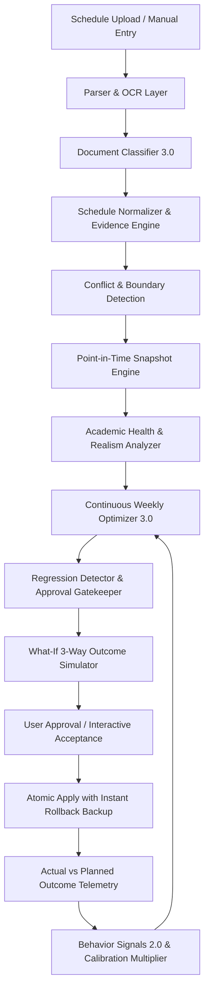

# FASE 35: System Architecture & Closed-Loop Intelligence Specifications

## 1. High-Level Closed-Loop Architecture



---

## 2. Core Architectural Components

### 2.1 Canonical Constants Domain (`ACADEMIC_CONSTANTS`)
Exposes immutable constants shared across all modules:
```typescript
export const ACADEMIC_CONSTANTS = {
  DEFAULT_MAX_DAILY_STUDY_MINUTES: 240,       // 4 hours (default personal study goal)
  DAILY_WORKLOAD_HARD_CAP_MINUTES: 360,       // 6 hours (hard cap for combined lecture + study)
  MIN_DAILY_STUDY_MINUTES: 60,                // 1 hour minimum clamped daily preference
  ADAPTIVE_MAX_SINGLE_SESSION_MINUTES: 90,    // 1.5 hours continuous study block cap
  MIN_SESSION_DURATION_MINUTES: 15,
  MAX_SESSION_DURATION_MINUTES: 360,
  DEFAULT_SESSION_DURATION_MINUTES: 60,
  DEFAULT_BREAK_DURATION_MINUTES: 30,
  MIN_BREAK_BUFFER_MINUTES: 30,
  PUNCTUALITY_TOLERANCE_MINUTES: 15,          // Tolerance for punctual start times
  CALIBRATION_MULTIPLIER_MIN: 0.70,           // Lower bound for empirical ranking adjustments
  CALIBRATION_MULTIPLIER_MAX: 1.30,           // Upper bound for empirical ranking adjustments
  MAX_SCHEDULE_UPLOAD_SIZE_BYTES: 15 * 1024 * 1024, // 15 MB file upload ceiling
} as const;
```

### 2.2 Point-in-Time Snapshot & Staleness Engine
* **Deterministic SHA-256 Hashing**: Canonicalized, case-insensitive, sorted representation ensures that calendar content produces an identical hash regardless of item ordering.
* **Optimistic Concurrency & Invalidation**: Proposals track `parentSnapshotHash`. If calendar changes occur after proposal generation, `evaluateContextStaleness()` flags `STALE` or `REVALIDATION_REQUIRED`, and `evaluateApprovalGate()` blocks application until refreshed.

### 2.3 Side-Effect-Free What-If Simulator
* Simulates 3 distinct scenarios in memory without persisting mutations to database:
  - **Scenario A (Current Baseline)**: Unmodified calendar.
  - **Scenario B (Proposed Modification)**: Direct application of move/add/delete actions.
  - **Scenario C (Balanced Recovery Plan)**: Alternative relocation avoiding dense days.
* Guarantees that the input array remains strictly immutable.

### 2.4 Multi-Tenant Security & Server Action Authorization
* Every server mutation in `src/actions/schedule-actions.ts` strictly verifies authenticated session via `supabase.auth.getUser()`.
* Client-provided `user_id` values in request payloads are completely stripped and replaced by the authenticated session `user.id`.
* Row-Level Security (RLS) policies isolate schedules, outcomes, preferences, and snapshots by user.

### 2.5 Explainability Engine 4.0
* Answers 12 transparency questions with quantitative, evidence-based Indonesian text covering slot selection, conflict status, workload impact, and ranking justifications.
