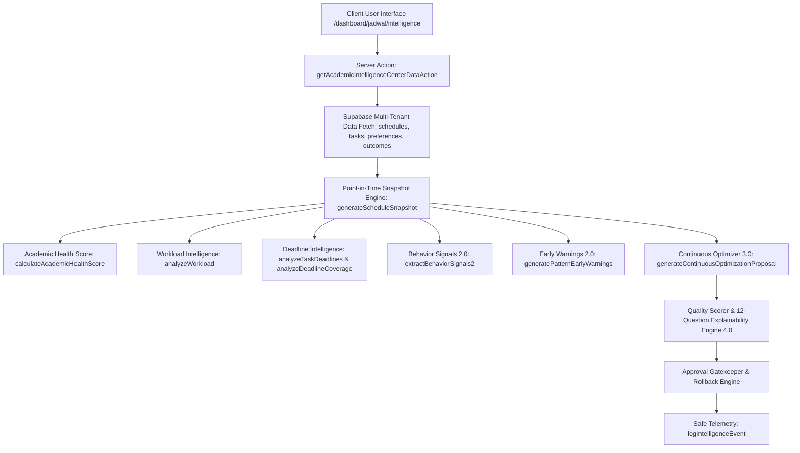

# FASE 36 — ACADEMIC INTELLIGENCE ARCHITECTURE & OBSERVABILITY SPECIFICATION

## 1. Executive Summary

FASE 36 transforms the entire Intelligent Schedule Automation engine developed across FASES 24 through 35 into an observable, explainable, and humanized product experience for college students. Rather than black-box algorithms or AI buzzwords, the system provides transparent, evidence-backed academic intelligence accessible directly via the dedicated `/dashboard/jadwal/intelligence` route.

---

## 2. Core Architecture Overview

---

## 3. High-Priority Invariants & Decision Framework

1. **Safety & Data Integrity**:
   - The intelligence layer NEVER makes unsolicited destructive writes to schedules or tasks.
   - All proposed schedule movements are evaluated against hard caps (maximum 360m / 6h per day).
2. **Deterministic Explainability**:
   - Every recommendation is accompanied by structured answers to the 12 Transparency Questions.
   - Strictly no speculative claims; all reasons state: *"Sistem memilih opsi ini karena..."*.
3. **Graceful Degradation for Low Data**:
   - When recorded sessions are $< 5$, behavior signals explicitly display: *"Belum cukup data..."* rather than fabricating percentages or psychological metrics.
4. **Isolated Observability**:
   - Telemetry tracks lifecycle events (`recommendation_generated`, `recommendation_reviewed`, `recommendation_accepted`, `recommendation_rejected`, `recommendation_applied`, `session_completed`, `session_skipped`) with sanitized payloads and zero PII.
