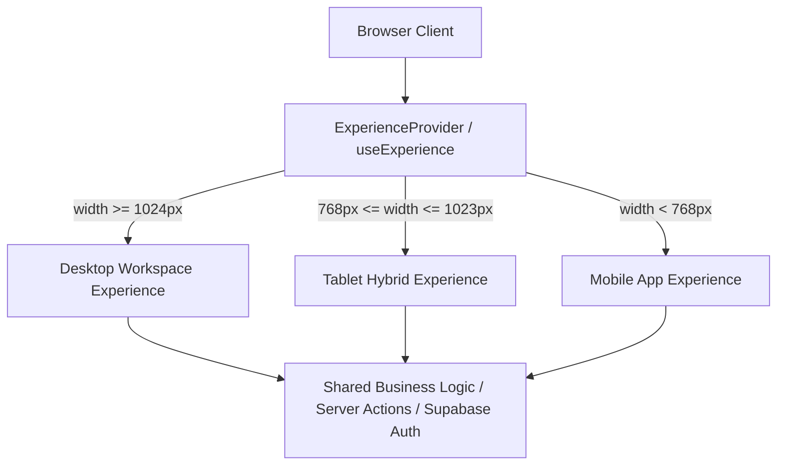

# VELQORA — PHASE 7 AUDIT
## TRUE WEB vs APP PRODUCT EXPERIENCE SEPARATION

---

### EXECUTIVE SUMMARY

Velqora has transitioned from a single responsive website into **two distinct, purpose-tailored product experiences** built on top of a unified backend, shared Supabase authentication, unified Next.js route structure, and shared business logic.

- **Web Experience (Desktop $\ge$ 1024px)**: Professional Learning Workspace inspired by modern productivity software (Linear / Notion-like density, clear visual hierarchy, multi-column and split-view workspaces, command palette, high-density data tables, keyboard shortcuts).
- **Mobile App Experience (Mobile $<$ 768px)**: Personal Learning App inspired by modern mobile utility and productivity apps (minimal top app bar, 5-destination thumb-friendly bottom navigation, app-style home with Continue Learning hero, compact list rows, bottom sheets, and full-screen viewers).
- **Tablet Experience (768px – 1023px)**: Intentional hybrid layout utilizing screen real estate comfortably with collapsible navigation rails and 2-column content flow.

---

### 1. ARCHITECTURE & EXPERIENCE DETECTION ABSTRACTION

#### Core Philosophy: "Same Product, Different Experience"
Instead of simple CSS-only media queries or duplicating the entire application code, Phase 7 establishes a clean **Experience Abstraction Layer**:

#### Breakpoint Invariants
- `BREAKPOINTS.MOBILE_MAX = 767`
- `BREAKPOINTS.TABLET_MIN = 768`
- `BREAKPOINTS.TABLET_MAX = 1023`
- `BREAKPOINTS.DESKTOP_MIN = 1024`

#### Declarative Composition Primitives
- `<ExperienceAdaptive desktop={<...>} tablet={<...>} mobile={<...>} />`
- `<DesktopOnly>` / `<MobileOnly>` / `<TabletOnly>`
- `useExperience()` hook exposing:
  - `experience`: `"desktop" | "tablet" | "mobile"`
  - `isDesktop`, `isTablet`, `isMobile`
  - `isPwaStandalone`: PWA standalone launch detection
  - `canInstallPwa`: `beforeinstallprompt` event hook
  - `promptInstallPwa()`: Trigger native browser installation

---

### 2. WEB WORKSPACE EXPERIENCE SPECIFICATIONS

#### Left Sidebar Workspace
- **Expanded**: 245px width
- **Collapsed**: 68px width
- **Structure**: Application workspace feel with workspace header, navigation categories (Akademik, Alat, Administrasi), keyboard shortcut tooltips, and bottom profile/settings/install controls.

#### Desktop Top Bar
- Contextual breadcrumb navigation
- Spotlight search bar trigger with keyboard shortcut indicator (`Ctrl + K` / `/`)
- Real-time online health indicator & Admin status badge
- Subtle "Pasang Aplikasi" / "Unduh App" CTA button
- User profile menu with fast account switching & photo management

#### Desktop Content Layouts
- **Dashboard Home**: High-density 2-column workspace (8-col active modules & recent readings; 4-col upcoming deadlines & quick tools).
- **Tasks (`/dashboard/tugas`)**: DesktopTable with structured columns (Task Name & Description, Subject/Lecturer, Due Date, Status, Priority, Contextual Action Menu `...`).
- **Modules (`/dashboard/modul`)**: Multi-column catalog with category sidebar, drive file explorer, and sort modal.
- **Materials (`/dashboard/materi`)**: Document workspace with file-type filtering, metadata view, and split preview.
- **Schedule (`/dashboard/jadwal`)**: Full-width calendar grid, workload intelligence table, and AI optimizer control center.
- **AI Tutor (`/dashboard/ai-tutor`)**: 3-column workspace with conversation history sidebar, chat window, and live knowledge base context bar.
- **Settings (`/dashboard/pengaturan`)**: Vertical navigation sidebar + right content form panel.

---

### 3. MOBILE APP EXPERIENCE SPECIFICATIONS

#### Mobile App Shell
- **Top Bar**: Minimal chrome (`< Back` button for subroutes, page title / brand logo, quick search icon, notification bell, user avatar).
- **Bottom Navigation**: 5 destinations with $\ge 44\text{px}$ touch targets:
  1. `Beranda` (`/dashboard`)
  2. `Materi` (`/dashboard/materi`)
  3. `Tugas` (`/dashboard/tugas`)
  4. `Modul` (`/dashboard/modul`)
  5. `Menu` (Triggers `MobileMenuDrawer`)
- **Mobile Menu Drawer**: Clean bottom sheet displaying:
  - AI Tutor Multimodal
  - Ruang Kelas
  - Berkas & Dokumen
  - Ruang Praktik Kode
  - Scanner & Konversi Dokumen
  - Pengaturan Akun & Tampilan
  - Pasang Aplikasi Velqora (PWA)
  - Panduan Pengguna

#### Mobile Home & Content Views
- **Home**: Warm personal greeting ("Selamat pagi/siang, [Name]"), Continue Learning Hero Card with progress bar and large primary CTA button `[Lanjutkan Belajar]`, Tugas Terdekat compact list, and Aktivitas Terakhir list. Zero 8-metric admin cards.
- **Tasks**: Compact list cards with deadline badges, priority indicators, and contextual bottom sheet actions.
- **Modules**: Stack-based navigation cards with lesson completion counters and progress bars.
- **Materials**: Content library list with file type icons (PDF, Video, Spreadsheet, Image, Doc) and full-screen viewer trigger.
- **Schedule**: Chronological Agenda list (HARI INI, BESOK, MINGGU INI) with session check-in and room badges.
- **AI Tutor**: Full-screen conversation mode with sticky bottom composer and clean message bubbles.

---

### 4. PWA & DOWNLOAD HUB SPECIFICATIONS

#### Dedicated Download Hub (`/download`)
- URL: `/download`
- Multi-Platform Guidance:
  - **Android**: Direct PWA install prompt button + Chrome 3-step guide.
  - **iOS (iPhone/iPad)**: Safari Share ⎋ $\to$ Add to Home Screen ⊞ guide.
  - **Desktop (Windows/Mac/Linux)**: Standalone desktop app installation guide.
- Live Standalone Mode Detection: Accurately identifies when running inside standalone PWA mode.

#### Web Manifest Invariants
- `name`: "Velqora — Modern Learning Platform"
- `short_name`: "Velqora"
- `display`: "standalone"
- `start_url`: "/dashboard"
- `theme_color`: "#090d16"
- `background_color`: "#000000"
- Icons: 192x192, 512x512, and 512x512 maskable icon.

---

### 5. DESIGN RIGOR & ANTI-SLOP ENFORCEMENT

1. **No Artificial Glow**: Zero `glow-neon`, neon borders, or pulsating neon text.
2. **No AI Orb Blobs**: Clean, functional SVG icons without floating animated orbs.
3. **No Card Nesting Overload**: Replaced unnecessary card wrappers with clean list rows, subtle separators, and semantic sections.
4. **No Color Chaos**: Strict adherence to Velqora tokens (Neutral Background, Surface, Border, Text Primary, Text Secondary, Precision Blue accent).
