# INVENTORY 26 TOPIK LEGACY-SYNTHETIC (PHASE 2.4)
**Dokumen Referensi**: VELQORA-INV-PHASE-2.4-01  
**Lead Architect**: Senior Curriculum Architect & Release Engineer  
**Tanggal Audit**: 16 September 2026  
**Status Baseline**: 26 Topik Berstatus `legacy-synthetic` | 2 Topik Parsial Pilot (`substantive-verified` Bab 1 & Bab 6)

---

## 1. Eksekutif Ringkasan Inventory

Berdasarkan audit langsung pada file kurikulum di `src/lib/curriculum/topics/` dan registri `src/lib/curriculum/registry.ts`, kurikulum Velqora terdiri dari **28 topik spesialisasi AI & Rekayasa Data**.

- **Modul Pilot Tervalidasi (Phase 2.3.1)**:
  - `ai-fundamentals` (Bab 1 Substantif Lolos 100%; Bab 2–10 masih `legacy-synthetic`).
  - `machine-learning` (Bab 1 & Bab 6 Substantif Lolos 100%; Bab 2–5 & Bab 7–22 masih `legacy-synthetic`).
- **Topik Warisan Murni (26 Topik)**:
  - Masih mempertahankan unit-unit sintetis pendek (rata-rata 34 kata/unit), pengulangan boilerplate generator lama, dan referensi URL generik yang harus diremediasi secara substantif.

---

## 2. Tabel Lengkap Inventory 26 Topik Warisan

| No | ID Topik | Nama Kurikulum | Kategori | Level | Bab | Subbab | Unit | Kode | Ref | Kebutuhan Dataset & Runtime | Dependensi Prasyarat | Risiko & Kompleksitas | Prioritas Migrasi |
|:---:|---|---|---|:---:|:---:|:---:|:---:|:---:|:---:|---|---|:---:|:---:|
| 1 | `deep-learning` | Deep Learning | Kecerdasan Buatan | lanjutan | 18 | 180 | 1.800 | 180 | 184 | PyTorch, torchvision, synthetic tensors | `machine-learning`, Aljabar Linier | **TINGGI** (Fondasi 8 topik) | **P1 (Batch 1)** |
| 2 | `data-science` | Data Science | Sains Data | lanjutan | 18 | 180 | 1.800 | 180 | 183 | Pandas, Scipy, Seaborn, California Housing | `machine-learning`, Statistika | **SEDANG** (Fondasi analisis) | **P1 (Batch 1)** |
| 3 | `natural-language-processing` | Natural Language Processing | Kecerdasan Buatan | lanjutan | 18 | 180 | 1.800 | 180 | 184 | NLTK, Hugging Face, IMDB/SST-2 | `deep-learning`, `machine-learning` | **TINGGI** (Prasyarat LLM) | **P2 (Batch 2)** |
| 4 | `computer-vision` | Computer Vision | Kecerdasan Buatan | lanjutan | 18 | 180 | 1.800 | 180 | 184 | OpenCV, PyTorch Vision, CIFAR-10 | `deep-learning` | **TINGGI** (Prasyarat Robotika) | **P2 (Batch 2)** |
| 5 | `large-language-model` | Large Language Model | Kecerdasan Buatan | lanjutan | 18 | 180 | 1.800 | 180 | 184 | Hugging Face Transformers, Tokenizers | `natural-language-processing` | **TINGGI** (Sangat diminati) | **P3 (Batch 3)** |
| 6 | `generative-ai` | Generative AI | Kecerdasan Buatan | lanjutan | 18 | 180 | 1.800 | 180 | 182 | PyTorch, Diffusers, Latent Tensors | `deep-learning`, `computer-vision` | **TINGGI** (Kompleksitas math) | **P3 (Batch 3)** |
| 7 | `data-engineering-ai` | Data Engineering & Big Data | Rekayasa Data | lanjutan | 18 | 180 | 1.800 | 180 | 182 | PySpark, DuckDB, Parquet, SQL | `data-science` | **SEDANG** (Infrastruktur) | **P4 (Batch 4)** |
| 8 | `vector-database-retrieval` | Basis Data Vektor & Retrieval | AI Infrastructure | lanjutan | 15 | 150 | 1.500 | 150 | 153 | FAISS, ChromaDB, Numpy HNSW | `data-engineering-ai`, `nlp` | **SEDANG** (Penting untuk RAG) | **P4 (Batch 4)** |
| 9 | `reinforcement-learning` | Reinforcement Learning | Kecerdasan Buatan | lanjutan | 15 | 150 | 1.500 | 150 | 154 | Gymnasium, Numpy, PyTorch | `ai-fundamentals`, `deep-learning` | **TINGGI** (Matematika MDP) | **P5 (Batch 5)** |
| 10 | `ai-agent` | AI Agent & Autonomous Systems | Kecerdasan Buatan | lanjutan | 15 | 150 | 1.500 | 150 | 154 | LangChain, ReAct loops, JSON tools | `ai-fundamentals`, `llm` | **SEDANG** (Aplikasi modern) | **P5 (Batch 5)** |
| 11 | `mlops-deployment` | MLOps & AI Deployment | Rekayasa Software | lanjutan | 18 | 180 | 1.800 | 180 | 184 | Docker, FastAPI, MLflow, ONNX | `machine-learning`, `deep-learning` | **SEDANG** (Operasional model) | **P6 (Batch 6)** |
| 12 | `edge-ai-tinyml` | Edge AI & TinyML | Perangkat Keras AI | lanjutan | 10 | 100 | 1.000 | 100 | 103 | TFLite, ONNX Runtime, Int8 Quant | `deep-learning`, `computer-vision` | **SEDANG** (Optimasi latency) | **P6 (Batch 6)** |
| 13 | `graph-neural-network` | Graph Neural Network (GNN) | Kecerdasan Buatan | lanjutan | 12 | 120 | 1.200 | 120 | 124 | PyTorch Geometric, NetworkX, Cora | `deep-learning`, Aljabar Graf | **TINGGI** (Matematika Spectral) | **P7 (Batch 7)** |
| 14 | `time-series-forecasting` | Peramalan Deret Waktu | Data Science | menengah | 15 | 150 | 1.500 | 150 | 153 | Statsmodels, Prophet, AirPassengers | `data-science`, `machine-learning` | **SEDANG** (Statistika temporal) | **P7 (Batch 7)** |
| 15 | `recommendation-system` | Recommendation System | Kecerdasan Buatan | lanjutan | 15 | 150 | 1.500 | 150 | 154 | Scikit-Learn, LightFM, MovieLens | `machine-learning`, `data-science` | **SEDANG** (Filtering matriks) | **P8 (Batch 8)** |
| 16 | `multimodal-ai` | Multimodal AI | Kecerdasan Buatan | lanjutan | 12 | 120 | 1.200 | 120 | 124 | CLIP, Audio-Visual embeddings | `computer-vision`, `nlp` | **TINGGI** (Cross-modal align) | **P8 (Batch 8)** |
| 17 | `speech-audio-ai` | Speech & Audio AI | Kecerdasan Buatan | lanjutan | 12 | 120 | 1.200 | 120 | 124 | Librosa, Torchaudio, Whisper | `deep-learning`, Pemrosesan Sinyal | **SEDANG** (Representasi fourier) | **P9 (Batch 9)** |
| 18 | `robotics-embodied-ai` | Robotics & Embodied AI | Kecerdasan Buatan | lanjutan | 15 | 150 | 1.500 | 150 | 154 | PyBullet, Kinematics equations | `reinforcement-learning`, `cv` | **TINGGI** (Fisika komputasi) | **P9 (Batch 9)** |
| 19 | `automl-nas` | AutoML & Neural Search | Kecerdasan Buatan | lanjutan | 12 | 120 | 1.200 | 120 | 124 | Optuna, Ray Tune, Scikit-Learn | `machine-learning`, `deep-learning` | **SEDANG** (Search spaces) | **P10 (Batch 10)** |
| 20 | `computational-intelligence` | Computational Intelligence | Kecerdasan Buatan | lanjutan | 12 | 120 | 1.200 | 120 | 123 | DEAP (GA), Scikit-Fuzzy, PSO | `ai-fundamentals`, Kalkulus | **SEDANG** (Heuristik meta) | **P10 (Batch 10)** |
| 21 | `knowledge-representation` | Knowledge Representation | Kecerdasan Buatan | lanjutan | 10 | 100 | 1.000 | 100 | 103 | RDFLib, OWL, Prover9, Ontologi | `ai-fundamentals`, Logika | **SEDANG** (Semantika formal) | **P11 (Batch 11)** |
| 22 | `expert-system` | Expert System | Kecerdasan Buatan | menengah | 10 | 100 | 1.000 | 100 | 103 | CLIPS / Python-experta, Rule trees | `knowledge-representation` | **RENDAH** (Rule-based klasik) | **P11 (Batch 11)** |
| 23 | `data-analyst` | Data Analyst | Analisis Data | menengah | 10 | 100 | 1.000 | 100 | 103 | SQL, Pandas, Matplotlib, E-commerce | Statistika Deskriptif | **RENDAH** (Komputasi dasar) | **P12 (Batch 12)** |
| 24 | `ai-security` | AI Security & Adversarial ML | Kecerdasan Buatan | lanjutan | 15 | 150 | 1.500 | 150 | 154 | Adversarial Robustness Toolbox, PyTorch | `deep-learning`, `ai-governance` | **TINGGI** (Keamanan sistem) | **P12 (Batch 12)** |
| 25 | `ai-ethics` | AI Ethics & Fairness | Kecerdasan Buatan | menengah | 10 | 100 | 1.000 | 100 | 103 | Fairlearn, AIF360, COMPAS dataset | `machine-learning` | **SEDANG** (Metrik keadilan) | **P13 (Batch 13)** |
| 26 | `ai-governance` | AI Governance & Compliance | Kecerdasan Buatan | menengah | 10 | 100 | 1.000 | 100 | 103 | EU AI Act, NIST AI RMF, ISO 42001 | `ai-ethics` | **RENDAH** (Standar hukum) | **P13 (Batch 13)** |

---

## 3. Peta Ketergantungan (Dependency Directed Acyclic Graph / DAG)

```mermaid
graph TD
    A["AI Fundamentals (Pilot Ch 1 Lolos)"] --> B["Machine Learning (Pilot Ch 1 & 6 Lolos)"]
    B --> C["Deep Learning (P1 - Batch 1)"]
    B --> D["Data Science (P1 - Batch 1)"]
    
    C --> E["Natural Language Processing (P2 - Batch 2)"]
    C --> F["Computer Vision (P2 - Batch 2)"]
    
    E --> G["Large Language Model (P3 - Batch 3)"]
    F --> H["Generative AI (P3 - Batch 3)"]
    C --> H
    
    D --> I["Data Engineering for AI (P4 - Batch 4)"]
    I --> J["Vector Database & Retrieval (P4 - Batch 4)"]
    E --> J
    
    A --> K["Reinforcement Learning (P5 - Batch 5)"]
    C --> K
    G --> L["AI Agent & Systems (P5 - Batch 5)"]
    A --> L
    
    C --> M["MLOps & Deployment (P6 - Batch 6)"]
    C --> N["Edge AI & TinyML (P6 - Batch 6)"]
    
    C --> O["Graph Neural Network (P7 - Batch 7)"]
    D --> P["Time Series Forecasting (P7 - Batch 7)"]
    
    B --> Q["Recommendation System (P8 - Batch 8)"]
    F --> R["Multimodal AI (P8 - Batch 8)"]
    E --> R
    
    C --> S["Speech & Audio AI (P9 - Batch 9)"]
    K --> T["Robotics & Embodied AI (P9 - Batch 9)"]
    F --> T
    
    C --> U["AutoML & NAS (P10 - Batch 10)"]
    A --> V["Computational Intelligence (P10 - Batch 10)"]
    
    A --> W["Knowledge Representation (P11 - Batch 11)"]
    W --> X["Expert System (P11 - Batch 11)"]
    
    D --> Y["Data Analyst (P12 - Batch 12)"]
    C --> Z["AI Security & Adversarial (P12 - Batch 12)"]
    
    B --> AA["AI Ethics & Fairness (P13 - Batch 13)"]
    AA --> AB["AI Governance & Compliance (P13 - Batch 13)"]
```

---

## 4. Evaluasi Risiko & Pertimbangan Urutan Migrasi

1. **Mengapa `deep-learning` & `data-science` Menjadi Batch 1**:
   - `deep-learning` adalah simpul terpenting dalam DAG. Delapan topik lanjutan (CV, NLP, LLM, GenAI, GNN, Speech, TinyML, MLOps) secara langsung bergantung pada konsep forward pass, backward pass, autograd, optimizer Adam/SGD, loss cross-entropy/MSE, dan modul PyTorch.
   - `data-science` melengkapi fondasi statistika dan manipulasi data riil (pandas, numpy, scipy) yang diperlukan untuk seluruh pemodelan data terapan.
2. **Ketersediaan Sumber Kanonikal SSOT**:
   - `src-goodfellow-deep-learning` (MIT Press 2016) sudah terdaftar di `source-registry.ts`.
   - Dokumentasi resmi `src-pytorch-nn-module-doc` dan `src-pytorch-autograd-doc` sudah terdaftar.
   - Paper optimizer `src-kingma-adam-2014` sudah terdaftar.
   - Dataset benchmark `src-dataset-california-housing` sudah terdaftar.
3. **Kesiapan Runtime Komputasi**:
   - Lingkungan Python 3.12 lokal telah dilengkapi pustaka standar data science (Numpy, Scipy, Pandas, Scikit-learn).
   - Eksekusi komputasi deep learning berbasis tensor CPU/GPU dapat dijalankan secara terisolasi tanpa data leakage.

---

## 5. Kesimpulan Tahap 1

Inventory telah memetakan 26 topik warisan secara terukur dan transparan. Tidak ada topik yang terlewat atau diabaikan. Prioritas migrasi telah disusun murni berdasarkan relasi ketergantungan ilmiah dan arsitektural.

**Status Tahap 1**: **COMPLETED & VERIFIED**
