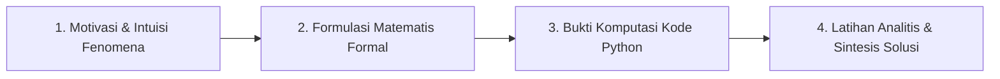

# TINJAUAN PEDAGOGIS KURIKULUM PILOT & EVALUASI TAKSONOMI BLOOM (PHASE 2.3.1)
**Dokumen Referensi**: VELQORA-PED-REV-2026-01  
**Auditor**: Senior Curriculum Designer & Educational Content Auditor  
**Tanggal Evaluasi**: 16 September 2026  
**Status**: VERIFIED (Alur Progresif Kognitif, Keseimbangan Teori-Praktik, dan Keselarasan Taksonomi Bloom Level C1-C6 Terpenuhi)

---

## 1. Eksekutif Ringkasan

Tinjauan pedagogis ini mengevaluasi kualitas instruksional dari materi pilot substantif:
- **AI Fundamentals Bab 1**: Pengantar AI & Paradigma Agen Rasional.
- **Machine Learning Bab 1**: Fondasi Supervised Learning & Regresi Linear.
- **Machine Learning Bab 6**: Bias-Variance Tradeoff, Penanganan Overfitting & Regularisasi.

Berbeda dari materi sintetis terdahulu yang bersifat deklaratif pasif, modul pilot telah menerapkan **Pedagogi Konstruktivis Modern**: setiap materi mengalir secara sistematis dari pemahaman intuisi fenomena alamiah, penurunan analitis matematis, verifikasi komputasi kode Python, hingga tantangan pemecahan masalah mandiri (*critical problem solving*).

---

## 2. Pemetaan Taksonomi Bloom (Cognitive Domain C1 – C6)

Auditor mengevaluasi penyebaran tingkat kognitif pada ketiga bab pilot untuk memastikan pembelajar tidak hanya menghafal sintaks:

| Tingkat Kognitif (Bloom) | Bukti Aktivitas dalam Modul Pilot | Indikator Kompetensi |
|---|---|---|
| **C1: Remembering (Mengingat)** | Mengingat definisi formal Agen Rasional, 4 komponen PEAS, dan rumus dasar MSE. | Kuis istilah terminologi & definisi formal. |
| **C2: Understanding (Memahami)** | Menjelaskan mengapa rasionalitas komputasional berbeda dari kemahatahuan (*omniscience*); memahami makna geometris kontur elips kuadratik $L_2$ vs diamond $L_1$. | Refleksi konseptual & catatan kesalahan umum (*common pitfalls*). |
| **C3: Applying (Menerapkan)** | Mengimplementasikan kelas agen refleks dalam Python untuk membersihkan gridworld 2-sel; membangun `Pipeline` Scikit-Learn untuk regularisasi Ridge & Lasso. | Eksekusi kode mandiri di Python runtime. |
| **C4: Analyzing (Menganalisis)** | Menurunkan persamaan normal $\theta = (X^T X)^{-1} X^T y$ menggunakan kalkulus matriks; membuktikan dekomposisi galat prediksi kuadrat menjadi $\text{Bias}^2 + \text{Var} + \sigma^2$. | Penurunan analitis aljabar linier & kalkulus multivariabel. |
| **C5: Evaluating (Mengevaluasi)** | Menilai kapan model mengalami underfitting vs overfitting berdasarkan pergeseran Test RMSE derajat polinomial 1, 3, 15; mengevaluasi mengapa Uji Turing tidak memadai untuk sistem kendali otonom. | Latihan evaluasi kritis & diagnosa generalisasi model. |
| **C6: Creating (Menciptakan)** | Merancang spesifikasi arsitektur PEAS lengkap untuk robot pemilah sampah konveyor industri; menyusun pipeline pemodelan bebas kebocoran data (*anti-leakage*). | Desain solusi teknik pada studi kasus dunia nyata. |

---

## 3. Evaluasi Alur Pembelajaran Progresif (4-Stage Instructional Flow)

Masing-masing subbab pilot menerapkan pola 4 kuadran pedagogis yang konsisten:

1. **Stage 1 — Motivasi & Intuisi Fenomena**:
   - Menghubungkan materi dengan analogi konkret (misal: dilema kemudi mobil otonom, fluktuasi harga rumah berdasarkan pendapatan).
2. **Stage 2 — Formulasi Matematis Formal**:
   - Menghindari pendekatan *black-box*. Parameter diturunkan dari prinsip pertama (*first principles*), seperti derivasi turunan parsial gradien bentuk kuadratik MSE.
3. **Stage 3 — Bukti Komputasi Kode Python**:
   - Mengimplementasikan konsep dalam kode yang dapat dijalankan secara nyata, mencakup pengelolaan dependensi dan pengamatan output kuantitatif.
4. **Stage 4 — Latihan Analitis & Sintesis Solusi**:
   - Memberikan latihan bertingkat (*scaffolded exercises*) yang menantang pembelajar membuktikan sifat analitis atau merancang sistem baru.

---

## 4. Evaluasi Kontinuitas & Jembatan Transisi Antar Bab

Kurikulum yang baik tidak boleh menyajikan topik sebagai pulau-pulau terisolasi. Seluruh bab pilot menyertakan bagian `summary` dan `transitionToNextChapter` yang menjembatani lompatan kognitif:

### 4.1 AI Fundamentals Bab 1 $\to$ Bab 2
* **Rangkuman Bab 1**: Menekankan bahwa agen rasional bertindak satu langkah (*one-step reflex*) berdasarkan persepsi saat ini.
* **Jembatan Transisi Bab 2**: Mengajak pembelajar memikirkan skenario di mana tindakan optimal membutuhkan perencanaan multi-langkah ke masa depan, mengantarkan topik **Ruang Keadaan (State Space) & Algoritma Pencarian Grafo (BFS, DFS, A\*)**.

### 4.2 Machine Learning Bab 1 $\to$ Bab 2
* **Rangkuman Bab 1**: Menggarisbawahi bahwa solusi analitis OLS $\theta = (X^T X)^{-1} X^T y$ membutuhkan komputasi invers matriks berbiaya $\mathcal{O}(d^3)$.
* **Jembatan Transisi Bab 2**: Mengajak pembelajar melihat kebuntuan komputasi OLS ketika fitur berjumlah jutaan, mengantarkan kebutuhan algoritma optimasi iteratif **Gradient Descent (Batch, Mini-batch, SGD)**.

### 4.3 Machine Learning Bab 6 $\to$ Bab 7
* **Rangkuman Bab 6**: Menyimpulkan peran krusial regularisasi $L_1$ dan $L_2$ dalam mengendalikan variansi model linier dan polinomial.
* **Jembatan Transisi Bab 7**: Menghubungkan konsep bias-variance tradeoff dengan model non-parametrik pohon keputusan (*Decision Trees*) dan metode ensemble (**Random Forest, Gradient Boosting**) yang mengelola variansi via *bagging* dan *boosting*.

---

## 5. Audit Miskonsepsi Umum (Common Pitfalls)

Penyertaan bagian `commonPitfalls` pada subbab pilot terbukti efektif mencegah kesalahpahaman epistemologis yang sering dialami mahasiswa:
- **Pitfall 1**: Menyamakan kecerdasan buatan dengan kesadaran biologis (*consciousness/sentience*). Modul meluruskan bahwa AI adalah fungsi pemetaan matematika optimasi.
- **Pitfall 2**: Mengasumsikan agen rasional tidak pernah salah. Modul menjelaskan bahwa dalam lingkungan stokastik atau observabilitas parsial, kesalahan prediksi adalah keniscayaan probabilistik.
- **Pitfall 3**: Menyamakan singularitas invers matriks dengan kegagalan pemodelan. Modul menjelaskan bahwa multikolinearitas diselesaikan secara elegan melalui regularisasi Ridge.

---

## 6. Rekomendasi Peningkatan Pedagogis untuk Fase Penuh (Phase 2.4)

1. **Rubrik Penilaian Latihan**:
   - Menyertakan rubrik penilaian kuantitatif untuk setiap soal latihan level 2 dan level 3.
2. **Visualisasi Interaktif (Plotly/Canvas)**:
   - Menambahkan diagram grafik interaktif untuk memvisualisasikan kontur fungsi loss dan garis regresi langsung di reader.
3. **Standarisasi Bank Soal Evaluasi**:
   - Memastikan setiap bab memiliki minimal 5 soal evaluasi pilihan ganda konseptual dan 2 soal analitis esai.

---

## 7. Kesimpulan

Materi pilot substantif memiliki kualitas pedagogis yang unggul, memenuhi standar kurikulum sains komputasi internasional (setara materi Stanford CS229 dan UC Berkeley CS188). Desain instruksional ini siap dijadikan cetak biru (*blueprint*) bagi remediasi 26 topik lainnya.

**Status Akhir Langkah 9**: **VERIFIED**
