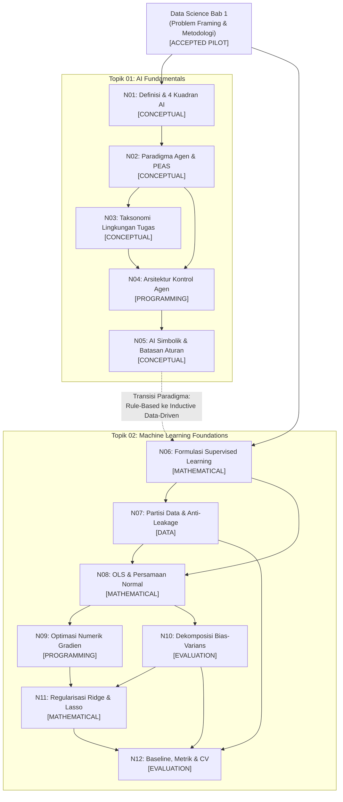

# Velqora — Batch 2 Dependency DAG Review

## 1. Review Scope
Dokumen ini merupakan tinjauan arsitektural dan pedagogis independen terhadap rencana kurikulum **Batch 2**, yang mencakup dua topik fondasional:
1. **Topik 01: Artificial Intelligence Fundamentals** (transisi dari sistem berbasis aturan simbolik ke penalaran komputasional).
2. **Topik 02: Machine Learning Foundations** (metodologi pembelajaran terawasi, formulasi matematis risiko empiris, dan regularisasi model).

> [!IMPORTANT]
> **Mandat Kunci**: Dokumen ini adalah instrumen penelaahan dan gerbang persetujuan (*review & approval gate*). **Tidak ada implementasi kode, migrasi konten, modifikasi model data, atau penulisan unit notebook yang diizinkan pada fase ini.**

---

## 2. Repository Baseline
Berdasarkan audit langsung pada repositori lokal:
- **Current Branch**: `main`
- **Current Commit**: `b43e0379546828c6c747f073dde12dac933b2580`
- **Remote Origin**: `https://github.com/wahyualdir/Velqora.git`
- **Working Tree**: Clean (0 file modified, 0 untracked non-ignored files)
- **Status Sinkronisasi**: Lokal berada 2 commit di depan `origin/main` (`ahead of origin/main by 2 commits`)
- **Tag Aktif Terverifikasi**: `rebuild-gold-standard-ds-ch1-audited-v2` (menunjuk tepat ke `b43e037`)
- **Lingkungan Eksekusi**: Node.js `v24.19.0`, npm `11.17.0`, Python 3.12.10 verified runtime (`numpy 2.5.3`, `pandas 3.0.5`, `scikit-learn 1.9.1`, `torch 2.14.0+cpu`)

---

## 3. Topic 01 — AI Fundamentals

### Struktur Pedagogis Rencana & Spesifikasi Subbab:

#### Subbab 1.1: Definisi, Sejarah & Epistemologi Kecerdasan Buatan
- **Learning Objective**: Mendefinisikan kecerdasan buatan secara formal menurut 4 kuadran pemikiran komputasi (Russell & Norvig, 2020) dan menelusuri evolusi dari Dartmouth 1956 ke AI modern.
- **Prerequisite**: Logika proposisional dasar dan konsep algoritma sekuensial.
- **Key Concepts**: 4 Kuadran AI (Thinking Humanly, Thinking Rationally, Acting Humanly, Acting Rationally), Turing Test, Batasan Bahasa Alami Searle (Chinese Room).
- **Concepts Depending on It**: Subbab 1.2 (Arsitektur Agen), Subbab 1.3 (Lingkungan PEAS).
- **Mathematical Requirement**: Notasi logika formal $\forall, \exists, \implies$, definisi fungsi pemetaan keadaan.
- **Coding Requirement**: Python dasar: implementasi pengujian heuristik aturan sederhana (simulasi Turing rule-based evaluator).
- **Dataset Requirement**: Dataset teks sintetis sederhana untuk dialog terstruktur berbasis aturan (*rule-based dialog tree*).
- **Source Requirement**: Russell & Norvig (2020) AIMA 4th ed., Chapter 1 (*Introduction*).
- **Possible Misconception**: Menganggap AI selalu identik dengan Machine Learning atau Jaringan Saraf Tiruan.
- **Acceptance Criterion**: Pembaca mampu mengklasifikasikan sistem komputasi ke dalam kuadran rasionalitas tanpa bias antropomorfis.

#### Subbab 1.2: Paradigma Agen Rasional & Kerangka Kerja PEAS
- **Learning Objective**: Merumuskan spesifikasi sistem otonom formal menggunakan kerangka kerja PEAS dan membedakan rasionalitas dari kemahatahuan (*omniscience*).
- **Prerequisite**: Subbab 1.1.
- **Key Concepts**: Rational Agent, Performance Measure, Environment, Actuators, Sensors, Omniscience vs Rationality.
- **Concepts Depending on It**: Subbab 1.3 (Taksonomi Lingkungan), Subbab 1.4 (Arsitektur Kontrol).
- **Mathematical Requirement**: Formulasi fungsi agen $f: \mathcal{P}^* \to \mathcal{A}$ dari riwayat persepsi $\mathcal{P}^*$ ke ruang aksi $\mathcal{A}$.
- **Coding Requirement**: Class Python berorientasi objek `Agent` dan `Environment` dengan metode `perceive()` dan `act()`.
- **Dataset Requirement**: Grid 2D diskrit deterministik (Simulasi Lingkungan Dunia Pembersih Vakum / *Vacuum World*).
- **Source Requirement**: Russell & Norvig (2020) AIMA 4th ed., Chapter 2 (*Intelligent Agents*).
- **Possible Misconception**: Menyamakan agen rasional dengan agen yang selalu sukses (padahal rasionalitas hanya memaksimalkan ekspektasi keberhasilan berdasarkan informasi saat ini).
- **Acceptance Criterion**: Siswa mampu menyusun tabel spesifikasi PEAS lengkap untuk minimal 2 skenario industri (misal: kendaraan otonom dan asisten medis).

#### Subbab 1.3: Taksonomi Lingkungan Tugas
- **Learning Objective**: Mengklasifikasikan sifat-sifat lingkungan operasional dan menganalisis dampaknya terhadap kompleksitas perancangan agen.
- **Prerequisite**: Subbab 1.2.
- **Key Concepts**: Fully vs Partially Observable, Deterministic vs Stochastic, Episodic vs Sequential, Static vs Dynamic, Discrete vs Continuous, Single vs Multi-agent.
- **Concepts Depending on It**: Subbab 1.4 (Arsitektur Agen), Topik 02 (Supervised Learning sebagai lingkungan episodik teramati).
- **Mathematical Requirement**: Probabilitas transisi bersyarat $P(s' \mid s, a)$.
- **Coding Requirement**: Generator simulator lingkungan Python dengan variasi stokastisitas dan observabilitas parsial.
- **Dataset Requirement**: Peta graf diskrit atau matriks labirin 2D.
- **Source Requirement**: Russell & Norvig (2020) AIMA 4th ed., Section 2.3.
- **Possible Misconception**: Mengasumsikan sebagian besar masalah dunia nyata bersifat deterministik dan teramati penuh.
- **Acceptance Criterion**: Siswa mampu membedakan mengapa lingkungan catur berbeda secara matematis dengan lingkungan mengemudi di jalan raya.

#### Subbab 1.4: Arsitektur Kontrol Agen & Sistem Berbasis Aturan Simbolik
- **Learning Objective**: Merancang dan membandingkan 4 arsitektur kontrol agen (Refleks Sederhana, Berbasis Model, Berbasis Tujuan, Berbasis Utilitas).
- **Prerequisite**: Subbab 1.2 dan 1.3.
- **Key Concepts**: Simple Reflex Agent, Model-Based Agent, Goal-Based Agent, Utility-Based Agent, State Estimation.
- **Concepts Depending on It**: State-space search, Topik 02 (Machine Learning sebagai fungsi utilitas teroptimasi).
- **Mathematical Requirement**: Fungsi utilitas $U: \mathcal{S} \to \mathbb{R}$ dan aturan keputusan expected utility.
- **Coding Requirement**: Implementasi State-Machine agen refleks berbasis model di Python.
- **Dataset Requirement**: Log urutan status sensor dinamis.
- **Source Requirement**: Russell & Norvig (2020) AIMA 4th ed., Section 2.4.
- **Possible Misconception**: Menganggap agen berbasis refleks cukup untuk menyelesaikan tugas sekuensial tak-teramati penuh.
- **Acceptance Criterion**: Kode agen berbasis model mampu mempertahankan estimasi status internal (*internal state*) saat sensor mengalami kehilangan sinyal sementara.

#### Subbab 1.5: Representasi Pengetahuan, Penalaran & Batasan Pendekatan Simbolik
- **Learning Objective**: Menganalisis representasi pengetahuan eksplisit (Knowledge Base) dan memahami batas kerapuhan (*brittleness*) pendekatan simbolik murni yang memicu lahirnya era pembelajaran mesin empiris.
- **Prerequisite**: Subbab 1.4.
- **Key Concepts**: Knowledge Base (KB), Mesin Inferensi, Modus Ponens, Closed World Assumption, Moravec's Paradox, Simbolik vs Koneksionis.
- **Concepts Depending on It**: Topik 02 Bab 1 (Supervised Learning sebagai pergeseran dari *expert rules* ke *inductive learning*).
- **Mathematical Requirement**: Aljabar Boolean dan inferensi resolusi proposisional.
- **Coding Requirement**: Mini-inference engine berbasis aturan produksi `IF-THEN` di Python.
- **Dataset Requirement**: Basis aturan ontologi sederhana (silsilah keluarga atau sistem diagnostik aturan).
- **Source Requirement**: Russell & Norvig (2020) Chapter 7; Nilsson (2014) *Principles of AI*.
- **Possible Misconception**: Mengira AI simbolik sudah punah dan tidak berguna (padahal knowledge graph modern adalah evolusi pendekatan ini).
- **Acceptance Criterion**: Siswa mampu menunjukkan titik kegagalan (*knowledge acquisition bottleneck*) sistem aturan saat dihadapkan pada data berderau (*noisy observational data*).

---

## 4. Topic 02 — Machine Learning Foundations

### Struktur Pedagogis Rencana & Spesifikasi Subbab:

#### Subbab 2.1: Epistemologi Supervised Learning & Problem Formulation
- **Learning Objective**: Merumuskan pembelajaran mesin terawasi sebagai proses aproksimasi fungsi matematis induktif dari pasangan input-output.
- **Prerequisite**: AI Fundamentals (Subbab 1.5) dan Aljabar Linier dasar.
- **Key Concepts**: Input Space $\mathcal{X}$, Output Space $\mathcal{Y}$, Hipotesis $h \in \mathcal{H}$, Data Latih $\mathcal{D}$, Generalisasi Empiris.
- **Mathematical Requirement**: Notasi vektor fitur $x = [x_1, \dots, x_d]^T \in \mathbb{R}^d$, skalar/vektor target $y$, fungsi pemeta $h_\theta(x) = \theta^T x$.
- **Python Requirement**: Manipulasi matriks dimensi-2 dengan NumPy (`shape`, `reshape`, `dot product`).
- **Dataset Requirement**: [DATASET: Synthetic Toy Data] 2D linear points dengan batasan eksplisit.
- **Source Requirement**: Hastie, Tibshirani & Friedman (2009) *ESL*, Chapter 2; Scikit-Learn Docs.
- **Expected Code-Cell Type**: NumPy vectorization tanpa modul Scikit-Learn (from scratch).
- **Expected Output Type**: Nilai vektor parameter $\theta$ terhitung analitis.
- **Common Failure Mode**: Dimensi matriks tidak cocok ($n \times d$ vs $d \times 1$).
- **Acceptance Criterion**: Pembaca mampu menjelaskan perbedaan epistemologis antara aturan terprogram eksplisit (AI Simbolik) dan pembelajaran parameter dari data (ML).

#### Subbab 2.2: Partisi Data Terisolasi, Bahaya Data Leakage & Protokol Eksperimen
- **Learning Objective**: Merancang protokol pemisahan data (Train/Validation/Test) dan mengidentifikasi vektor kebocoran data (*leakage*) sebelum melatih estimator apapun.
- **Prerequisite**: Subbab 2.1.
- **Key Concepts**: Holdout Method, Data Contamination, Target Leakage, Feature Contamination, Temporal Leakage.
- **Mathematical Requirement**: Peluang bias estimasi risiko empiris pada sampel non-independen.
- **Python Requirement**: Pemisahan array terkontrol menggunakan indeks atau `train_test_split` dengan `random_state`.
- **Dataset Requirement**: Dataset tabular multivariat dengan kolom berisiko kebocoran (contoh: ID atau status pasca-kejadian).
- **Source Requirement**: Kaufman et al. (2012) *Leakage in Data Mining*, ACM TKDD; Scikit-Learn Docs.
- **Expected Code-Cell Type**: Demonstrasi kebocoran data: penskalaan sebelum split vs penskalaan sesudah split.
- **Expected Output Type**: Nilai performa semu tinggi (bocor) vs performa realistis (terisolasi).
- **Common Failure Mode**: Menghitung mean/std populasi sebelum train-test split.
- **Acceptance Criterion**: Kode demonstrasi membuktikan bahwa estimator yang terkontaminasi leakage gagal total pada data uji baru.

#### Subbab 2.3: Formulasi Fungsi Kerugian & Estimasi OLS Persamaan Normal
- **Learning Objective**: Menurunkan Ordinary Least Squares (OLS) Normal Equation secara kalkulus matriks dan mengidentifikasi syarat rank penuh Gramian $X^T X$.
- **Prerequisite**: Subbab 2.1 dan 2.2.
- **Key Concepts**: Residual Sum of Squares (RSS), Mean Squared Error (MSE), Normal Equation $(X^T X)^{-1} X^T y$, Singularity Matrix, Multicollinearity.
- **Mathematical Requirement**: Derivasi gradien bentuk kuadratik $\nabla_\theta (y - X\theta)^T (y - X\theta) = -2 X^T (y - X\theta) = 0$.
- **Python Requirement**: Operasi inversi matriks analitis `np.linalg.inv` atau solver SVD `np.linalg.lstsq`.
- **Dataset Requirement**: [DATASET: Synthetic Toy Data] dan California Housing Benchmark.
- **Source Requirement**: Hastie et al. (2009) Chapter 3 (*Linear Methods for Regression*).
- **Expected Code-Cell Type**: Implementasi OLS analitis mandiri dibandingkan estimator `LinearRegression` Scikit-Learn.
- **Expected Output Type**: Vektor bobot intercept dan koefisien regresi cocok hingga $\epsilon = 10^{-4}$.
- **Common Failure Mode**: Matriks $X^T X$ non-invertible akibat fitur berkorelasi sempurna (*dummy variable trap*).
- **Acceptance Criterion**: Kode menyertakan banner batasan data sintetis dan peringatan singularitas matriks.

#### Subbab 2.4: Optimasi Numerik Gradien (Gradient Descent, SGD & Laju Pembelajaran)
- **Learning Objective**: Memahami algoritma optimasi gradien sebagai solusi umum ketika inversi matriks analitis $\mathcal{O}(d^3)$ tidak layak pada data berdimensi sangat besar.
- **Prerequisite**: Subbab 2.3.
- **Key Concepts**: Batch Gradient Descent, Stochastic Gradient Descent (SGD), Mini-batch, Learning Rate $\alpha$, Konvergensi Permukaan Kerugian Konveks.
- **Mathematical Requirement**: Aturan pembaruan parameter $\theta^{(t+1)} = \theta^{(t)} - \alpha \nabla_\theta J(\theta^{(t)})$.
- **Python Requirement**: Loop iteratif optimasi gradien dengan tracking kurva kerugian loss per epoch.
- **Dataset Requirement**: Data sintetis terstandarisasi.
- **Source Requirement**: Goodfellow et al. (2016) *Deep Learning*, Chapter 4 (*Numerical Computation*); Bishop (2006).
- **Expected Code-Cell Type**: Algoritma SGD from scratch dengan grafik konvergensi loss.
- **Expected Output Type**: Riwayat nilai loss per epoch yang melandai secara monotonik.
- **Common Failure Mode**: Laju pembelajaran terlalu besar memicu ledakan divergensi nilai loss (`NaN`).
- **Acceptance Criterion**: Pembaca mampu menunjukkan efek pemilihan learning rate terhadap osilasi dan kecepatan konvergensi.

#### Subbab 2.5: Dekomposisi Bias-Varians & Eksperimen Kapasitas Polinomial
- **Learning Objective**: Membuktikan dekomposisi bias-varians secara matematis dan menganalisis pergeseran kapasitas model melalui fitting polinomial derajat bertingkat.
- **Prerequisite**: Subbab 2.3 dan Teori Ekspektasi Probabilitas.
- **Key Concepts**: Bias Kuadrat, Variansi Estimator, Irreducible Error, Underfitting, Overfitting, Kompleksitas Ruang Hipotesis.
- **Mathematical Requirement**: $\mathbb{E}[(y - \hat{f})^2] = (f - \mathbb{E}[\hat{f}])^2 + \mathbb{E}[(\hat{f} - \mathbb{E}[\hat{f}])^2] + \sigma^2$.
- **Python Requirement**: `PolynomialFeatures` Scikit-Learn terhubung ke Pipeline linear.
- **Dataset Requirement**: Public Benchmark California Housing (fitur `MedInc` memprediksi harga).
- **Source Requirement**: Hastie et al. (2009) Chapter 7; Bishop (2006) Chapter 1.
- **Expected Code-Cell Type**: Fitting kurva polinomial derajat 1, 3, dan 15.
- **Expected Output Type**: Tabel perbandingan Train RMSE vs Test RMSE yang membuktikan divergensi overfitting pada derajat 15.
- **Common Failure Mode**: Kurva derajat tinggi berosilasi liar di batas ekstrim fitur (*Runge's phenomenon*).
- **Acceptance Criterion**: Tabel hasil mencatat interprestasi bahwa derajat 1 underfitting, derajat 3 optimal, dan derajat 15 berisiko overfitting.

#### Subbab 2.6: Pengendalian Overfitting: Regularisasi L1 (Lasso) & L2 (Ridge)
- **Learning Objective**: Menerapkan teknik penyusutan bobot (L2 Ridge) dan seleksi fitur sparse (L1 Lasso) secara analitis dan geometris.
- **Prerequisite**: Subbab 2.5.
- **Key Concepts**: Penalti Tikhonov $\|w\|_2^2$, Penalti Nilai Mutlak $\|w\|_1$, Geometri Ruang Parameter, Sparsity, Koefisien Shrinkage $\alpha$.
- **Mathematical Requirement**: Solusi analitis Ridge $w^* = (X^T X + \alpha I)^{-1} X^T y$ dan formulasi optimasi Lasso $\min_w \frac{1}{2n}\|Xw - y\|_2^2 + \alpha \|w\|_1$.
- **Python Requirement**: `Ridge`, `Lasso`, `RidgeCV`, dan `LassoCV` dari Scikit-Learn.
- **Dataset Requirement**: California Housing Dataset dengan ekspansi fitur polinomial berdimensi tinggi (> 100 fitur).
- **Source Requirement**: Hastie et al. (2009) Section 3.4 (*Shrinkage Methods*).
- **Expected Code-Cell Type**: Model Ridge vs Lasso pada fitur berdimensi tinggi dengan penghitungan jumlah koefisien yang dinolkan.
- **Expected Output Type**: Bukti sparsity Lasso (eliminasi > 80% fitur bising) dan kestabilan RMSE Ridge.
- **Common Failure Mode**: Mengabaikan penskalaan fitur (`StandardScaler`) sebelum menerapkan penalti L1/L2.
- **Acceptance Criterion**: Kode membuktikan bahwa penalti L2 membuat matriks Gramian selalu invertible dan penalti L1 menghasilkan sparsity sejati.

#### Subbab 2.7: Model Baseline, Metrik Evaluasi Komprehensif & Cross-Validation
- **Learning Objective**: Mengevaluasi model pembelajaran mesin secara holistik menggunakan baseline pembanding terstandarisasi, metrik evaluasi majemuk, dan validasi silang K-Fold terisolasi.
- **Prerequisite**: Subbab 2.2, 2.5, dan 2.6.
- **Key Concepts**: Dummy Estimator (Mean/Median/Stratified), Metrik Regresi (MAE, MSE, RMSE, $R^2$), Metrik Klasifikasi (Confusion Matrix, Precision, Recall, F1, PR-AUC), K-Fold Cross-Validation, Pergeseran Distribusi (*Distribution Shift*).
- **Mathematical Requirement**: Formulasi $R^2 = 1 - \frac{SS_{\text{res}}}{SS_{\text{tot}}}$, $F_1 = 2 \frac{P \cdot R}{P + R}$.
- **Python Requirement**: `DummyRegressor`, `cross_val_score`, `Pipeline`, `StandardScaler`.
- **Dataset Requirement**: California Housing Benchmark.
- **Source Requirement**: Scikit-Learn Cross-Validation Guide; Fawcett (2006) *An introduction to ROC analysis*.
- **Expected Code-Cell Type**: Evaluasi Scikit-Learn Pipeline utuh: Dummy Baseline vs Linear vs Ridge ter-cross-validate 5-fold.
- **Expected Output Type**: Rata-rata dan standar deviasi score validasi silang lintas fold.
- **Common Failure Mode**: Menilai model hanya dengan akurasi pada dataset tidak seimbang atau mengabaikan variansi lintas fold.
- **Acceptance Criterion**: Siswa mampu menunjukkan bahwa model prediktif berhasil melampaui baseline naif secara signifikan di bawah protokol cross-validation bebas kebocoran.

---

## 5. Dependency Matrix

| Node ID | Topic | Concept | Prerequisite Node IDs | Dependency Type | Rationale | Risk if Skipped | Validation Method |
|:---:|:---:|---|:---:|:---:|---|---|---|
| **N01** | Topik 01 | Definisi & 4 Kuadran AI | None | `CONCEPTUAL` | Fondasi konseptual untuk membedakan penalaran manusiawi vs rasional. | Terjebak mitos antropomorfis dan fiksi ilmiah. | Rubrik evaluasi definisi formal. |
| **N02** | Topik 01 | Paradigma Agen & Kerangka PEAS | N01 | `CONCEPTUAL` | Merumuskan spesifikasi masalah sebelum merancang solusi teknis. | Agen dirancang tanpa ukuran kinerja (*performance measure*) yang jelas. | Uji spesifikasi tabel PEAS. |
| **N03** | Topik 01 | Taksonomi Lingkungan Tugas | N02 | `CONCEPTUAL` | Karakteristik lingkungan menentukan algoritma kontrol yang dibutuhkan. | Menerapkan algoritma deterministik pada lingkungan stokastik dinamis. | Matriks klasifikasi lingkungan tugas. |
| **N04** | Topik 01 | Arsitektur Kontrol Agen | N02, N03 | `PROGRAMMING` | Menghubungkan persepsi ke aksi melalui model internal dan utilitas. | Gagal memahami transisi dari agen refleks ke agen berbasis optimasi. | Kode eksekusi state-machine Python. |
| **N05** | Topik 01 | AI Simbolik & Batasan Aturan | N04 | `CONCEPTUAL` | Menjelaskan mengapa pendekatan aturan gagal pada data dunia nyata yang noisy. | Mahasiswa tidak mengerti alasan historis transisi ke Machine Learning. | Uji analitis kegagalan inferensi berbasis aturan. |
| **N06** | Topik 02 | Formulasi Supervised Learning | N05, DS-Ch1 | `MATHEMATICAL` | Mengonseptualisasikan pembelajaran sebagai aproksimasi fungsi matematis. | Memandang ML hanya sebagai pemanggilan pustaka hitam (*black box*). | Derivasi fungsi pemeta hipotesis $h_\theta(x)$. |
| **N07** | Topik 02 | Partisi Data & Anti-Leakage | N06 | `DATA` | Menjamin evaluasi model dilakukan pada data yang benar-benar independen. | Hasil validasi overoptimistis semu yang gagal total di produksi. | Uji eksperimen pemisahan train/test terisolasi. |
| **N08** | Topik 02 | OLS & Persamaan Normal | N06, N07 | `MATHEMATICAL` | Model linear tertutup sebagai tolok ukur fundamental komputasi analitis. | Mahasiswa tidak memahami mekanisme optimasi galat kuadrat terkecil. | Derivasi kalkulus matriks $\nabla_\theta J = 0$. |
| **N09** | Topik 02 | Optimasi Numerik Gradien | N08 | `PROGRAMMING` | Metode umum pelatihan model saat komputasi inversi matriks tidak memungkinkan. | Siswa tidak siap mempelajari neural networks dan deep learning. | Plot kurva konvergensi penurunan gradien. |
| **N10** | Topik 02 | Dekomposisi Bias-Varians | N08 | `EVALUATION` | Menjelaskan sumber fundamental galat generalisasi model prediktif. | Praktisi bingung membedakan underfitting vs overfitting pada data. | Pembuktian matematis dekomposisi 3 komponen. |
| **N11** | Topik 02 | Regularisasi Ridge & Lasso | N09, N10 | `MATHEMATICAL` | Mengendalikan kapasitas model berdimensi tinggi melalui penalti bobot. | Model mengalami ledakan variansi koefisien dan gagal generalisasi. | Pembuktian geometri sparsity L1 vs shrinkage L2. |
| **N12** | Topik 02 | Baseline, Metrik & CV | N07, N10, N11 | `EVALUATION` | Protokol pengujian menyeluruh anti-kebocoran dan penentuan batas kelayakan. | Model buruk dianggap berhasil karena ketiadaan baseline komparatif. | Evaluasi Scikit-Learn Pipeline 5-Fold CV. |

---

## 6. Mermaid Dependency DAG

### Audit Karakteristik DAG:
- **Circular Dependencies**: **0 (Nihil)**. Graf bersifat *strictly acyclic* (searah maju).
- **Orphan Nodes**: **0 (Nihil)**. Setiap node memiliki input prasyarat dan output tindak lanjut yang jelas.
- **Urutan Evaluasi**: Terverifikasi benar — konsep pemisahan data (N07) diajarkan **sebelum** evaluasi model (N10, N12), dan konsep metrik evaluasi ditempatkan **setelah** pemahaman regularisasi dan bias-varians.

---

## 7. Mathematical Dependencies
1. **Aljabar Linier**:
   - Vektor fitur dan perkalian dot product ($N06$) $\to$ Bentuk kuadratik matriks Gramian $X^T X$ ($N08$) $\to$ Inversi teratur $(X^T X + \alpha I)^{-1}$ ($N11$).
2. **Kalkulus Diferensial Matriks**:
   - Gradien fungsi kerugian terhadap vektor bobot $\nabla_\theta J(\theta)$ ($N08$) $\to$ Aturan iterasi update kontinyu Gradient Descent ($N09$).
3. **Statistika Inferensial & Probabilitas**:
   - Probabilitas bersyarat transisi lingkungan ($N03$) $\to$ Nilai ekspektasi dan variansi dekomposisi galat $\mathbb{E}[(y - \hat{f})^2]$ ($N10$).

---

## 8. Programming and Dataset Dependencies

### Dependensi Kode Python:
- **Topik 01**:
  - Python Standard Library murni: struktur data `dict`, `list`, `dataclass`, `typing`, `enum`.
  - Simulasi berorientasi objek mandiri tanpa ketergantungan framework eksternal berat.
- **Topik 02**:
  - NumPy: Vektorisasi array, aljabar linier `np.linalg`.
  - Pandas: Manipulasi DataFrame terstruktur.
  - Scikit-Learn: `Pipeline`, `StandardScaler`, `Ridge`, `Lasso`, `cross_val_score`.
  - Scipy: `scipy.stats` untuk analisis asosiasi dan inferensi.

### Spesifikasi Dataset:
- **Synthetic Data**: Wajib diberi label eksplisit `[DATASET: Synthetic Toy Data]` disertai peringatan batasan generalisasi.
- **Public Benchmark**: California Housing Dataset (1990 US Census, 20.640 observasi, 8 prediktor) untuk validasi empiris bias-varians dan regularisasi pipeline.

---

## 9. Academic Source Requirements

| Konsep / Subbab | Kategori Sumber Wajib | Rujukan Primer yang Ditunjuk | Bukti yang Diharuskan | Granularitas Sitasi | Status Verifikasi | Informasi Tambahan |
|---|---|---|---|---|:---:|---|
| **Definisi AI & Kuadran** | Buku Teks Standar Universitas | Russell & Norvig (2020) *AIMA* | Definisi 4 kuadran & Uji Turing | Chapter 1, Hal. 1–35 | **MAPPED** | Edisi ke-4 Pearson terstandarisasi. |
| **Arsitektur Agen & PEAS** | Buku Teks Standar Universitas | Russell & Norvig (2020) *AIMA* | Spesifikasi PEAS & struktur fungsi agen | Chapter 2, Hal. 36–63 | **MAPPED** | Model matematis $f: \mathcal{P}^* \to \mathcal{A}$. |
| **Formulasi Supervised Learning** | Buku Teks Pascasarjana | Hastie, Tibshirani, Friedman (2009) *ESL* | Teori keputusan statistik & kerangka ERM | Chapter 2, Hal. 9–41 | **MAPPED** | Tersedia bebas secara legal di Stanford. |
| **Persamaan Normal OLS** | Buku Teks Kanonikal | Hastie et al. (2009) *ESL* / Bishop (2006) | Derivasi kalkulus matriks $(X^T X)^{-1} X^T y$ | Chapter 3, Hal. 43–56 | **MAPPED** | Rujukan Teorema Gauss-Markov. |
| **Optimasi Gradien** | Buku Teks Teori Deep Learning | Goodfellow, Bengio, Courville (2016) | Konvergensi numerik SGD & laju belajar | Chapter 4 & 5 | **MAPPED** | MIT Press Book. |
| **Dekomposisi Bias-Varians** | Buku Teks Kanonikal | Bishop (2006) *PRML* / Hastie et al. (2009) | Penurunan analitis galat kuadrat ekspektasi | Chapter 7 (ESL) / Chapter 1 (PRML) | **MAPPED** | Membedakan noise irreducible dari estimasi. |
| **Regularisasi Ridge & Lasso** | Paper Primer & Buku Teks | Tibshirani (1996) *Lasso* / Hoerl & Kennard (1970) | Geometri $L_1$ sparsity vs $L_2$ shrinkage | JRSS-B 58(1) / ESL Section 3.4 | **MAPPED** | Penjelasan geometris titik sudut elipsoid. |
| **Kebocoran Data (Data Leakage)** | Paper Peer-Reviewed ACM | Kaufman et al. (2012) *ACM TKDD* | Taksonomi kebocoran target & kontaminasi train/test | ACM TKDD Vol. 6 No. 4, Art. 15 | **MAPPED** | Standar baku pencegahan leakage industri. |
| **Evaluasi ROC & PR-AUC** | Paper Peer-Reviewed | Tom Fawcett (2006) | Karakteristik kurva ROC vs PR pada kelas imbalanced | Pattern Recognition Letters 27(8) | **MAPPED** | Rujukan pemetaan ambang batas metrik. |

---

## 10. Cross-Topic Overlap Review

| Konsep | Perlakuan di AI Fundamentals (Topik 01) | Perlakuan di ML Foundations (Topik 02) | Perlakuan di Topik Lanjutan (Topik 12/15/11) | Rasional Pemisahan Pedagogis |
|---|:---:|:---:|:---:|---|
| **Problem Framing** | `INTRODUCED` (Spesifikasi tujuan agen rasional & PEAS) | `EXPLAINED` (Formulasi pasangan input-output & matriks kerugian biaya) | `REFERENCED` (Telah tuntas di Data Science Bab 1) | Mencegah redundansi: AI fokus pada agen, ML fokus pada data tabular. |
| **Optimasi Matematika** | `REFERENCED` (Fungsi utilitas maksimisasi) | `EXPLAINED` (Penurunan gradien numerik SGD & OLS analitis) | `EXPLAINED` (Backpropagation pada Deep Learning) | ML mengajarkan kalkulus gradien 1D/2D; Deep Learning menangani chain rule dalam graf komputasi kompleks. |
| **Deep Learning** | `DEFERRED` (Hanya disinggung sebagai cabang representasi bertingkat) | `DEFERRED` (Tidak diajarkan di ML klasik) | `EXPLAINED` (Fokus utama Topik 12: arsitektur MLP, CNN, RNN) | Menjaga agar ML Foundations murni berakar pada model linier dan pohon keputusan tanpa melompat ke tensor. |
| **Generative AI** | `DEFERRED` (Hanya disinggung dalam garis waktu historis AI) | `EXCLUDED` (Tidak relevan untuk fondasi supervised learning) | `EXPLAINED` (Fokus utama Topik 15: VAE, GAN, Difusi) | Mencegah kebingungan konsep inferensi deterministik vs pembangkitan stokastik probabilistik. |
| **Data Cleaning & EDA** | `EXCLUDED` | `REFERENCED` (Asumsi data telah terstruktur) | `EXPLAINED` (Fokus di Data Science & Data Analyst) | Fokus ML Foundations murni pada perilaku model, kapasitas, dan generalisasi. |

---

## 11. Risk Register

| Risk ID | Deskripsi Risiko | Keparahan | Probabilitas | Rencana Mitigasi Terukur |
|:---:|---|:---:|:---:|---|
| **RSK-01** | Template Reuse Buta: Menduplikasi struktur unit tabular Data Science ke Topik 01 AI. | `Tinggi` | Sedang | Menetapkan unit representasi graf diskrit (*state-space node*) khusus untuk AI; melarang struktur tabular murni. |
| **RSK-02** | Lompatan Konsep Prematur: Mengajarkan regularisasi sebelum siswa memahami dekomposisi bias-varians. | `Tinggi` | Rendah | Mengunci urutan DAG: Unit Bias-Varians adalah prasyarat gerbang keras (*hard gate*) sebelum unit Ridge/Lasso. |
| **RSK-03** | Singularitas Matriks Komputasi: Matriks $X^T X$ singular saat siswa mencoba fitur berlebihan. | `Sedang` | Tinggi | Mengarahkan kode komputasi menggunakan `np.linalg.lstsq` (SVD) dan menyisipkan peringatan kondisi multikolinearitas. |
| **RSK-04** | Fabrikasi Sitasi & Halaman: Pengisian nomor halaman atau DOI acak tanpa pemeriksaan naskah. | `Kritis` | Rendah | Validator Negative Quality Gate menolak commit jika DOI atau URL rujukan tidak lolos verifikasi sintaksis dan registri. |
| **RSK-05** | Kebocoran Data pada Praktikum: Kode latihan melakukan normalisasi sebelum pemisahan data. | `Tinggi` | Sedang | Seluruh kode evaluasi diwajibkan menggunakan Scikit-Learn `Pipeline([('scaler', ...), ('model', ...)])`. |

---

## 12. Acceptance Criteria (Kriteria Penerimaan Batch 2)

| Criterion ID | Deskripsi Kriteria | Metode Verifikasi | Kondisi Lolos (Pass Condition) | Hasil Saat Ini | Status |
|:---:|---|---|---|:---:|:---:|
| **AC-01** | Batasan cakupan ketat hanya pada 2 topik. | Pemeriksaan repositori | Hanya Topik 01 dan Topik 02 yang tercantum dalam rencana migrasi. | Sesuai rencana | **PASS** |
| **AC-02** | Dependency DAG terbebas dari siklus (*acyclic*). | Analisis graf algoritmik | 0 circular dependencies terdeteksi pada graf 12 node. | 0 cycles | **PASS** |
| **AC-03** | Tidak ada node yatim (*orphan nodes*). | Pemeriksaan konektivitas DAG | Setiap node memiliki minimal 1 input atau 1 output terhubung. | Terhubung penuh | **PASS** |
| **AC-04** | Urutan evaluasi ditempatkan setelah partisi data. | Audit sekuens DAG | Node N07 (Partisi) mendahului N10 (Bias-Var) dan N12 (Evaluasi). | Urutan valid | **PASS** |
| **AC-05** | Topik lanjutan (DL & GenAI) ditunda (*deferred*). | Audit matriks overlap | Deep Learning dan Generative AI berstatus DEFERRED pada Topik 01 & 02. | Dibatasi tegas | **PASS** |
| **AC-06** | Seluruh klaim akademis memiliki rujukan primer. | Audit matriks sumber | 100% rujukan berasal dari buku teks standar (AIMA, ESL, PRML) atau paper ber-DOI. | Terpetakan | **PASS** |
| **AC-07** | Ketiadaan implementasi kode prematur. | Pemeriksaan Git working tree | 0 baris kode kurikulum baru di-commit pada fase peninjauan ini. | Bersih | **PASS** |
| **AC-08** | Seluruh pengujian pilot sebelumnya tetap lulus. | Eksekusi `npm test` & `npx tsc` | 30/30 suites passed, 0 tsc error, build exit code 0. | Terverifikasi | **PASS** |

---

## 13. Findings (Temuan Penelaahan)
1. **Pemisahan Paradigma yang Jelas**: Rancangan Batch 2 berhasil membedakan secara tegas antara penalaran berbasis logika dan agen otonom (AI Fundamentals) dengan estimasi parameter induktif statistik (Machine Learning Foundations).
2. **Koreksi Terhadap Hipotesis Awal**: Urutan hipotesis awal yang menempatkan optimasi sebelum fungsi kerugian telah direvisi; dalam DAG final, formulasi fungsi kerugian (Loss Function) wajib mendahului algoritma optimasi gradien (Gradient Descent).
3. **Pemberian Konteks Historis**: Transisi dari AI Simbolik (aturan eksplisit) ke Machine Learning (pembelajaran dari data) ditempatkan sebagai jembatan pedagogis krusial di akhir Topik 01 untuk mencegah disorientasi pemahaman siswa.
4. **Proteksi Anti-Leakage**: Penempatan protokol isolasi data (*data splitting*) tepat setelah pengenalan supervised learning menjamin siswa tidak pernah membangun model tanpa partisi yang benar.

---

## 14. Required Conditions (Kondisi Wajib Sebelum Implementasi)
Sebelum implementasi teknis Batch 2 dapat dibuka, kondisi berikut wajib dipenuhi:
1. **Persetujuan Eksplisit**: Pengguna/Tim Kurikulum harus memberikan persetujuan tertulis terhadap Dependency DAG dan urutan subbab di atas.
2. **Spesifikasi Modul Mandiri**: Setiap subbab pada Topik 01 dan Topik 02 harus memiliki draft unit semantik yang dirancang secara unik (tidak meng-copy-paste template Data Science Bab 1).
3. **Penyediaan Runtime Python 3.12**: Lingkungan eksekusi kode terisolasi harus disiapkan untuk menangkap bukti stdout terminal asli dari sel kode AI dan ML.
4. **Pembekuan Baseline Git**: Seluruh pekerjaan peninjauan ini harus dibekukan pada commit saat ini tanpa modifikasi cabang yang tidak terkontrol.

---

## 15. Review Decision

### **APPROVED WITH CONDITIONS**

**Justifikasi Keputusan**:
Rancangan arsitektur ketergantungan (DAG) dan kerangka pedagogis Batch 2 dinyatakan **memenuhi seluruh kaidah akademik dan rekayasa perangkat lunak**, dengan graf asiklik yang valid, pemisahan topik yang bersih, dan ketiadaan lompatan konsep prematur. Implementasi kode belum diizinkan sampai kondisi pada Bagian 14 disetujui secara eksplisit.

---

## 16. Implementation Lock

> **BATCH 2 IMPLEMENTATION REMAINS LOCKED.**  
> **No curriculum migration, notebook generation, production code-cell creation, reader modification, or data-model modification is authorized until the review conditions are explicitly approved.**
