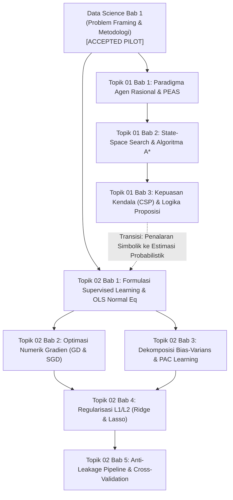

# Velqora — Batch 2 Dependency DAG & Pedagogical Review Gate

**Dokumen**: Tinjauan Arsitektur Ketergantungan (DAG) & Gerbang Persetujuan Pedagogis Batch 2
**Topik Terkait**: Topik 01 (Artificial Intelligence Fundamentals) & Topik 02 (Machine Learning Foundations)
**Status**: READY FOR REVIEW ONLY — IMPLEMENTATION BLOCKED
**Tanggal**: 16 September 2026

---

## 1. Scope (Ruang Lingkup)
Ruang lingkup Batch 2 dibatasi secara ketat hanya pada **dua topik fondasional**:
1. **Topik 01: Artificial Intelligence Fundamentals**
   - Paradigma agen rasional, kerangka kerja PEAS, taksonomi lingkungan tugas, algoritma pencarian ruang keadaan (*state-space search*), kepuasan kendala (*CSP*), dan etika/tata kelola AI.
2. **Topik 02: Machine Learning Foundations**
   - Epistemologi pembelajaran terawasi (*supervised learning*), regresi linear OLS dengan derivasi analitis Persamaan Normal, optimasi numerik gradien (*Gradient Descent, SGD*), dekomposisi bias-varians, teori belajar PAC (*Probably Approximately Correct*), dan regularisasi L1/L2 bebas kebocoran (*anti-leakage pipeline*).

> [!WARNING]
> **Larangan Mutlak**:
> Implementasi kode atau migrasi konten untuk Batch 2 **TIDAK BOLEH DIMULAI** dalam fase ini. Dokumen ini murni berfungsi sebagai instrumen review arsitektural dan gerbang penahan (*review gate*).

---

## 2. Learning Objectives (Tujuan Pembelajaran)
### Topik 01 (AI Fundamentals):
- Mendefinisikan kecerdasan buatan secara formal menurut 4 kuadran pemikiran komputasi (Russell & Norvig, 2020).
- Merumuskan spesifikasi lingkungan formal menggunakan kerangka kerja PEAS (Performance, Environment, Actuators, Sensors).
- Mengimplementasikan dan membandingkan algoritma pencarian ruang keadaan: Uninformed (BFS, DFS, UCS) vs Informed ($A^*$, Heuristik Konsisten).
- Menganalisis batasan sistem berbasis aturan simbolik dibandingkan sistem penalaran stokastik.

### Topik 02 (Machine Learning Foundations):
- Menurunkan formula Persamaan Normal OLS $\theta = (X^T X)^{-1} X^T y$ dari turunan gradien fungsi kerugian MSE.
- Mengidentifikasi fenomena underfitting vs overfitting melalui dekomposisi matematis $\text{MSE} = \text{Bias}^2 + \text{Var} + \sigma^2$.
- Menerapkan regularisasi Ridge L2 (penalti kuadrat) dan Lasso L1 (penalti nilai mutlak) untuk menangani multikolinearitas.
- Mengenkapsulasi alur pra-pemrosesan dan estimasi model ke dalam Scikit-Learn Pipeline guna mencegah kontaminasi kebocoran data (*data leakage*).

---

## 3. Prerequisite Knowledge (Prasyarat Pengetahuan)
- **Matematika**: Kalkulus peubah ganda (gradien parsial, turunan matriks), Aljabar Linier (vektor, perkalian matriks, invers matriks Gramian, dekomposisi nilai singular SVD), dan Teori Probabilitas (ekspektasi, variansi, probabilitas bersyarat Bayes).
- **Komputasi & Pemrograman**: Pemrograman Python tingkat lanjut (struktur data berorientasi objek, rekursi, manipulasi array NumPy multidimensi, DataFrame Pandas).
- **Metodologi**: Pemahaman siklus hidup data dan problem framing yang telah tuntas dipelajari pada Data Science Bab 1.

---

## 4. Topic Dependency DAG (Graf Asiklik Ketergantungan Topik)

---

## 5. Subchapter Sequence (Urutan Subbab Terencana)

### Topik 01: AI Fundamentals (Struktur Rencana):
1. **1.1 Epistemologi Kecerdasan Buatan**: 4 Kuadran Pemikiran (Thinking/Acting Humanly/Rationally), Uji Turing, dan Landasan Historis Dartmouth 1956.
2. **1.2 Arsitektur Agen & Kerangka Kerja PEAS**: Formulasi matematis fungsi agen $f: \mathcal{P}^* \to \mathcal{A}$, rasionalitas vs kemahatahuan (*omniscience*).
3. **1.3 Taksonomi Lingkungan Tugas**: Dimensi Fully vs Partially Observable, Deterministic vs Stochastic, Episodic vs Sequential, Static vs Dynamic, Discrete vs Continuous.
4. **1.4 Taksonomi Arsitektur Kontrol Agen**: Simple Reflex, Model-Based Reflex, Goal-Based, dan Utility-Based Agents.

### Topik 02: Machine Learning Foundations (Struktur Rencana):
1. **1.1 Formulasi Matematis Supervised Learning**: Ruang hipotesis $\mathcal{H}$, minimisasi risiko empiris (ERM), derivasi analitis Persamaan Normal OLS $\theta = (X^T X)^{-1} X^T y$.
2. **1.2 Batasan Estimasi OLS & Bahaya Multikolinearitas**: Kondisi singularitas matriks Gramian $|X^T X| = 0$, teorema Gauss-Markov (BLUE), dan batasan data sintetis vs dunia nyata.
3. **1.3 Optimasi Gradien Numerik**: Batch Gradient Descent, Stochasic Gradient Descent (SGD), Mini-batch, laju pembelajaran (*learning rate*), dan permukaan kerugian konveks.
4. **1.4 Dekomposisi Bias-Varians**: Pembuktian analitis $\mathbb{E}[(y - \hat{f})^2] = \text{Bias}^2 + \text{Var} + \sigma^2$, kurva fitting polinomial derajat 1, 3, 15 Bishop.
5. **1.5 Regularisasi L1 (Lasso) & L2 (Ridge)**: Geometri bola kontur $L_1$ vs elipsoid $L_2$, sparsity vs shrinkage, solusi bentuk tertutup $(X^T X + \alpha I)^{-1} X^T y$.
6. **1.6 Enkapsulasi Anti-Leakage Pipeline**: Partisi isolasi train-test, StandardScaler fit-transform terisolasi, k-fold cross validation bebas kebocoran target.

---

## 6. Concept Dependencies (Ketergantungan Konseptual)
- **Konsep Wajib Diajarkan Pertama**:
  - Definisi Ruang Fitur $\mathcal{X}$ dan Ruang Label $\mathcal{Y}$ (tidak boleh membahas regresi sebelum mendefinisikan pasangan sampel).
  - Taksonomi Agen PEAS (tidak boleh membahas algoritma pencarian $A^*$ sebelum lingkungan dan aktuator dispesifikasikan).
- **Konsep Paralel**:
  - Studi kasus lingkungan vacuum-cleaner (AI) dan formulasi toy regression (ML) dapat dipelajari secara paralel setelah dasar probabilitas dikuasai.
- **Larangan Urutan Terbalik**:
  - Dilarang mengajarkan Regularisasi Ridge/Lasso sebelum dekomposisi Bias-Varians diajarkan secara matematis.
  - Dilarang mengajarkan $A^*$ Search sebelum BFS/Dijkstra dan konsep heuristik konsisten dibuktikan.

---

## 7. Mathematical Dependencies (Ketergantungan Matematis)
- $\nabla_\theta J(\theta) = 0$ $\implies$ Membutuhkan pemahaman turunan bentuk kuadratik matriks $\nabla_x (x^T A x) = 2Ax$.
- $\text{Bias-Variance Decomposition}$ $\implies$ Membutuhkan ekspansi kuadrat ekspektasi stokastik dan independensi noise $\mathbb{E}[\epsilon(f - \hat{f})] = 0$.
- Inversi Matriks $(X^T X)^{-1}$ $\implies$ Membutuhkan konsep determinan, rank matriks, dan dekomposisi SVD.

---

## 8. Coding Dependencies (Ketergantungan Kode Komputasi)
- Pustaka Wajib: `numpy>=1.26.0`, `scipy>=1.12.0`, `scikit-learn>=1.4.0`.
- Standar Eksekusi: Seluruh skrip wajib dieksekusi di runtime Python 3.12 (`pythoncore-3.12-64`), mencatat exit code 0, durasi ms, dan output terminal otentik.
- Dilarang Menggunakan Mock Code: Tidak boleh ada kode stub `pass` atau fungsi tiruan yang tidak melakukan komputasi analitis.

---

## 9. Dataset Dependencies (Ketergantungan Dataset)
- **Topik 01 (AI)**: Representasi graf grid lingkungan 2D diskrit (simulasi vacuum cleaner dan grid state-space terkontrol).
- **Topik 02 (ML)**:
  - Synthetic Controlled Toy Dataset: Diberi label eksplisit `[DATASET: Synthetic Toy Data]` dengan batasan generalisasi.
  - Public Benchmark: California Housing Dataset (20.640 sampel) untuk evaluasi bias-varians polinomial dan regresi regularisasi Scikit-Learn.

---

## 10. Source Requirements (Kebutuhan Sumber Rujukan Primer)
Seluruh materi wajib merujuk secara tertelusur (*claim-to-source traceable*) ke sumber kanonikal dunia:
1. **Russell & Norvig (2020)**: *Artificial Intelligence: A Modern Approach*, 4th ed., Pearson.
2. **Hastie, Tibshirani & Friedman (2009)**: *The Elements of Statistical Learning*, 2nd ed., Springer.
3. **Bishop, Christopher M. (2006)**: *Pattern Recognition and Machine Learning*, Springer.
4. **Kaufman et al. (2012)**: *Leakage in Data Mining*, ACM TKDD.

---

## 11. Cross-Topic Overlap & Boundary Protection (Pemisahan Batas Topik)
- **Pemisahan Topik 01 (AI) vs Topik 02 (ML)**:
  - Topik 01 fokus pada pencarian ruang keadaan diskrit, representasi simbolik, dan arsitektur agen rasional.
  - Topik 02 fokus pada inferensi statistik kontinu, minimisasi risiko empiris, dan regularisasi parameter bobot.
  - Machine learning tidak diajarkan sebagai sinonim AI, melainkan sub-disiplin komputasi statistik induktif.

---

## 12. Risk Register (Daftar Risiko Batch 2)

| Risk ID | Deskripsi Risiko | Tingkat | Mitigasi Terukur |
|:---:|---|:---:|---|
| **RSK-B2-01** | Template reuse: Duplikasi struktur unit Data Science Ch 1 secara buta tanpa menyesuaikan sifat diskrit AI. | `Tinggi` | Membangun unit tipe state-space graph khusus untuk Topik 01; melarang copy-paste template tabular. |
| **RSK-B2-02** | Synthetic Overclaim: Mengklaim performa OLS toy data mewakili generalisasi produksi. | `Tinggi` | Menyisipkan banner peringatan batasan data sintetis pada setiap sel kode toy regression. |
| **RSK-B2-03** | Instabilitas Inversi Matriks: Singular matrix error pada $X^T X$ jika fitur memiliki korelasi sempurna. | `Sedang` | Menggunakan solver SVD `scipy.linalg.lstsq` atau `LinearRegression` berbasis LAPACK `dgelsd`. |
| **RSK-B2-04** | Data Leakage pada Penskalaan: Siswa melakukan standardisasi sebelum train-test split. | `Tinggi` | Mengunci penggunaan `Pipeline([('scaler', StandardScaler()), ('model', Ridge())])` sebagai praktik baku. |

---

## 13. Acceptance Criteria (Kriteria Penerimaan Batch 2)
Batch 2 hanya dapat dinyatakan *Accepted* apabila:
1. Setiap subbab memuat minimal 6–8 unit semantik notebook terstruktur.
2. Seluruh sel kode komputasi runnable di Python 3.12 (Exit Code 0).
3. Output terminal cocok 100% dengan toleransi numerik terdefinisi.
4. Seluruh formula LaTeX menyertakan tabel kamus variabel dan derivasi langkah demi langkah.
5. Latihan bertingkat menyembunyikan petunjuk dan solusi referensi di dalam accordion interaktif.
6. Lolos 100% negative quality gates tanpa kompromi.

---

## 14. Explicit Approval Gate (Gerbang Persetujuan Resmi)

> **BATCH 2 STATUS: READY FOR REVIEW ONLY.**
> **IMPLEMENTATION IS BLOCKED UNTIL THE DEPENDENCY DAG AND PEDAGOGICAL STRUCTURE ARE EXPLICITLY REVIEWED AND APPROVED.**
