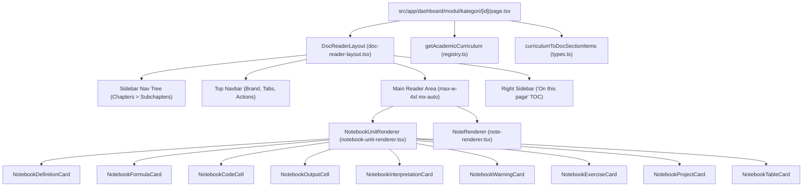

# Velqora — Module Reader & Academic Content Rebuild Audit

**Document ID**: `AUD-MRR-2026-09`  
**Status**: `PHASE 1 — AUDIT COMPLETED`  
**Review Decision**: `STRICT EXECUTION LOCK ACTIVE — NO CODE CHANGES IN THIS PHASE`  
**Date**: September 2026  
**Auditor**: Senior Software Architect, Frontend Engineer & Instructional Designer  

---

## 1. Executive Summary & Baseline

Sistem pembaca modul Velqora saat ini mengalami disonansi arsitektural dan visual: tampilan antarmuka menyerupai dashboard dokumentasi teknis yang dihasilkan secara otomatis (*auto-generated API docs*) daripada platform pembelajaran akademik universitas yang tenang, terstruktur, dan nyaman dibaca untuk sesi panjang (*deep study*).

### Repository Baseline Saat Audit Dimulai:
- **Current Branch**: `main`
- **Current Commit**: `7a158401cb86b08b55644d8a2b9b04a4a9415c46`
- **Working Tree**: Clean (0 modified, 0 untracked files)
- **Verified Active Tag**: `rebuild-gold-standard-ds-ch1-audited-v2`
- **Remote Origin**: `https://github.com/wahyualdir/Velqora.git` (synchronized)
- **TypeScript Typecheck**: `npx tsc --noEmit` -> **0 Errors (Passed)**
- **Test Suites**: 30 Jest Suites passed (237 tests), 21 Negative Quality Gates passed (100%)
- **Python Verified Runtime**: Python 3.12.10 verified runtime with NumPy 2.5.3, Pandas 3.0.5, Scikit-Learn 1.9.1, Torch 2.14.0+cpu

---

## 2. Arsitektur Komponen Saat Ini & Dependency Map

### 2.1 Peta Ketergantungan Komponen Reader:


### 2.2 Alur Data (Data Flow):
1. **Entry Point**: `src/app/dashboard/modul/kategori/[id]/page.tsx` mengekstrak `categoryId` dari parameter rute URL.
2. **Penyelarasan Kurikulum**:
   - Memanggil `getAcademicCurriculum(decodedId)` dari `src/lib/curriculum/registry.ts`.
   - Mengambil modul dari basis data Supabase melalui `getModules()` dan catatan Obsidian melalui `getNotesByCategory()`.
3. **Transformasi Model Data**:
   - Jika kurikulum akademik 28 topik ditemukan: dikonversi menjadi hierarki `DocSectionItem[]` melalui `curriculumToDocSectionItems()`.
   - Jika berupa catatan Obsidian: diekstrak subbabnya melalui regex heading `extractSubsectionsFromNote()`.
   - Jika tidak ada: dilakukan fallback ke `getDefaultAiSections()` yang diperkaya oleh `enrichCurriculumToDocSections()`.
4. **Rendering Pembaca**:
   - `DocReaderLayout` mengontrol state `selectedId` (disinkronkan dengan URL query `?section=...`).
   - Jika seksi memiliki `units: NotebookUnit[]`, dirender oleh `NotebookUnitRenderer`.
   - Jika seksi berupa markdown biasa, dirender oleh `NoteRenderer`.

---

## 3. Identifikasi Masalah & Analisis Akar Masalah (Root Causes)

### 3.1 Masalah Layout: Terjepit dalam 3 Kolom Kaku
- **Gejala**: Area membaca utama terasa sempit, sesak, dan melelahkan.
- **Akar Masalah**:
  - Kolom kiri (Sidebar) memakan lebar `w-72 sm:w-80 lg:w-84` (288px - 336px).
  - Kolom kanan ("On this page") memakan lebar tetap `w-64` (256px) secara permanen pada layar $\ge 1280\text{px}$ (`xl:flex`).
  - Total ruang yang dimakan navigasi samping mencapai **592px**! Pada layar laptop standar 1366x768 atau desktop 1280x800, area baca tersisa kurang dari 680px sebelum dikurangi padding dan scrollbar.
  - Kolom kanan tidak memiliki tombol toggle atau collapse bagi pengguna (hanya ada state internal tanpa pemicu UI).

### 3.2 Masalah Desain Visual: Tumpukan Kartu Terisolasi ("Card Fatigue")
- **Gejala**: Halaman terlihat seperti susunan kartu produk e-commerce atau dashboard analitik terfragmentasi.
- **Akar Masalah**:
  - Setiap unit semantik (`definition`, `formula`, `code`, `output`, `interpretation`, `warning`, `exercise`) dibungkus dalam container `<div className="rounded-xl border border-border bg-surface shadow-sm overflow-hidden">`.
  - Satu subbab dengan 8 unit menghasilkan 8 kartu bertingkat terpisah dengan border tebal dan header warna-warni.
  - Tidak ada alur naratif atau tipografi pemersatu yang mengalirkan pembaca dari konsep teoritis ke implementasi kode.

### 3.3 Masalah Presentasi Sel Kode & Output
- **Gejala**: Blok kode terasa berat secara visual, metadata berlebihan, dan output terputus dari kode.
- **Akar Masalah**:
  - `NotebookCodeCell` dan `NotebookOutputCell` dirender sebagai dua kartu terpisah yang independen.
  - Setiap sel kode memajang badge status runtime, dependencies, runtime complexity, memory complexity, dan failure modes secara sekaligus tanpa *progressive disclosure*.
  - Garis kode panjang memicu horizontal overflow pada container sempit, memaksa scrolling horizontal yang mengganggu fokus membaca.

### 3.4 Masalah Hirarki Navigasi & Penomoran
- **Gejala**: Navigasi sidebar terlalu padat dan mengekspos terlalu banyak level hierarki sekaligus.
- **Akar Masalah**:
  - Accordion sidebar membuka bab, subbab, dan unit sub-subbab secara serentak, menghasilkan daftar puluhan item yang memanjang.
  - Terdapat potensi ketidakkonsistenan penomoran antara label sidebar (`1.1`, `1.2`) dengan heading markdown di dalam konten (`## 1.1`, `### Definisi...`).
  - Tidak adanya utilitas validasi penomoran otomatis yang memeriksa apakah terdapat nomor yang hilang (misal 1, 2, 4 tanpa 3) atau heading kosong.

### 3.5 Masalah Responsivitas & Aksesibilitas
- **Gejala**: Pada tablet dan layar kecil, layout rusak atau elemen navigasi menutupi konten.
- **Akar Masalah**:
  - Toolbar aksi di bagian atas artikel (`Tanya AI Tutor`, `Uji Kuis`, `Playground`, `Salin Tautan`) membungkus secara canggung pada resolusi $< 640\text{px}$.
  - Kurangnya atribut ARIA (`aria-expanded`, `aria-controls`, `aria-live`) pada accordion navigasi dan tombol salin kode.
  - Hirarki heading semantik melompat dari `H1` (judul materi) langsung ke `H3` atau `H4` di dalam komponen kartu tanpa `H2` yang jelas.

---

## 4. Analisis Konten Modul Utama Saat Ini

| Modul / Topik | Status Implementasi Saat Ini | Struktur Konten | Catatan Kualitas Akademik |
|---|---|---|---|
| **Data Science Bab 1** (`11-data-science.ts`) | `ACCEPTED — GOLD STANDARD PILOT` | 6 Subbab, 49 Notebook Units (AST verified) | Telah diaudit ketat. Berfungsi sebagai tolok ukur acuan baku (*gold standard*). Menggunakan rumus KaTeX lengkap, bukti eksekusi Python 3.12, dan dataset California Housing. |
| **AI Fundamentals Bab 1** (`pilot-content.ts` & `05-ai-fundamentals.ts`) | `READY FOR REVIEW ONLY` (Legacy fallback active) | 2 Subbab di `pilot-content.ts`, 6 bab umum di `05-ai-fundamentals.ts` | Belum dimigrasikan ke model unit notebook penuh. Masih menggunakan struktur teks markdown dan contoh kode gridworld sederhana. |
| **Machine Learning Foundations** (`19-machine-learning.ts`) | `READY FOR REVIEW ONLY` (Legacy fallback active) | Bab 1-6 sintetik terstruktur | Memerlukan restrukturisasi independen yang tidak menjiplak struktur Data Science. Rencana DAG telah disetujui bersyarat. |

---

## 5. Batasan Berkas & Manajemen Risiko

### 5.1 Berkas yang Boleh Dimodifikasi (Fase Rekonstruksi Mendatang):
- `src/components/modul/doc-reader-layout.tsx`: Rekonstruksi layout content-first, navigasi sidebar tenang, collapsible outline.
- `src/components/modul/notebook/notebook-unit-renderer.tsx`: Transformasi dari tumpukan kartu terisolasi ke narasi akademik mengalir.
- `src/components/modul/notebook/notebook-code-cell.tsx`: Desain sel notebook terpadu dengan progressive disclosure.
- `src/components/modul/notebook/notebook-output-cell.tsx`: Penyatuan sel output dengan sel kode terkait.
- `src/components/modul/notebook/notebook-formula-card.tsx`: Tipografi matematika KaTeX elegan tanpa kotak berlebih.
- `src/components/modul/notebook/notebook-definition-card.tsx`: Callout akademis minimalis.
- `src/lib/curriculum/types.ts`: Penambahan tipe abstraksi tingkat tinggi `AcademicLesson` dengan kompatibilitas mundur penuh.

### 5.2 Berkas yang TIDAK Boleh Dimodifikasi:
- `src/actions/*` (Supabase server actions, study actions, notes actions).
- `src/lib/supabase/*` (Konfigurasi client & server Supabase).
- `src/components/ui/*` (Komponen atomik design system global).
- Modul kurikulum legacy selain pilot yang belum diizinkan untuk migrasi.
- Database schema dan migration SQL.

### 5.3 Risiko Migrasi & Rencana Rollback:
- **Risiko Regresi**: Modifikasi pada `DocReaderLayout` dapat merusak rendering 27 topik kurikulum legacy yang masih mengandalkan format `NoteRenderer`.
  - **Mitigasi**: Menjaga branching logika `currentSection.units ? <NotebookUnitRenderer /> : <NoteRenderer />` tetap utuh.
- **Rencana Rollback**:
  - Baseline Git telah dibekukan pada commit `7a15840` dan ditandai dengan tag `rebuild-gold-standard-ds-ch1-audited-v2`.
  - Jika terjadi kegagalan fatal pada fase berikutnya, eksekusi pemulihan instan dapat dilakukan melalui:
    ```bash
    git checkout 7a15840 -- src/
    ```

---

## 6. Rekomendasi Arsitektural untuk Fase 2–6

1. **Prinsip Content-First Reader**:
   - Area membaca utama harus menjadi fokus visual mutlak dengan lebar nyaman **720–900px**.
   - Kolom kiri (Sidebar) harus dapat disembunyikan (*collapsible*) dan lebih ramping (`w-64` atau `w-72`).
   - Kolom kanan ("On this page") diubah menjadi floating outline atau panel collapsible yang tidak memakan lebar konten utama secara permanen.
2. **Eliminasi "Card Fatigue"**:
   - Mengubah renderer unit menjadi bagian dari tipografi artikel berkelanjutan (menggunakan tipografi, whitespace, divider halus, dan callout minimal daripada kartu berlapis border tebal).
3. **Penyatuan Siklus Kode-Output-Interpretasi**:
   - Mengintegrasikan kode, output terminal aktual, dan interpretasi domain menjadi satu kesatuan pedagogis sekuensial.
4. **Utilitas Audit Penomoran & Kualitas**:
   - Membangun skrip validator penomoran heading dan pendeteksi boilerplate untuk menjamin konten substantif bebas duplikasi.

---

## 7. Status Penguncian Eksekusi (Strict Execution Lock)

> **STRICT EXECUTION LOCK: ACTIVE**  
> Audit fase 1 telah selesai. **Tidak ada kode produksi yang diubah, tidak ada konten yang dimigrasikan secara prematur, dan tidak ada tag atau push yang dibuat.** Repositori tetap berada pada status bersih baseline `7a15840`.
